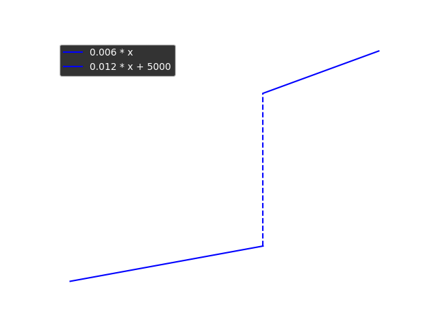
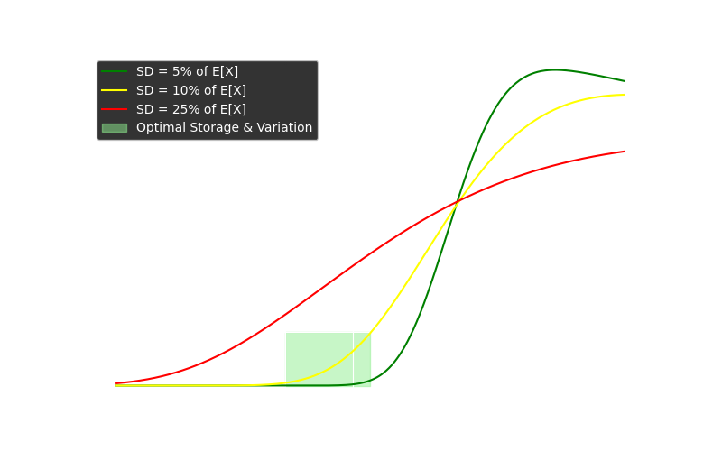
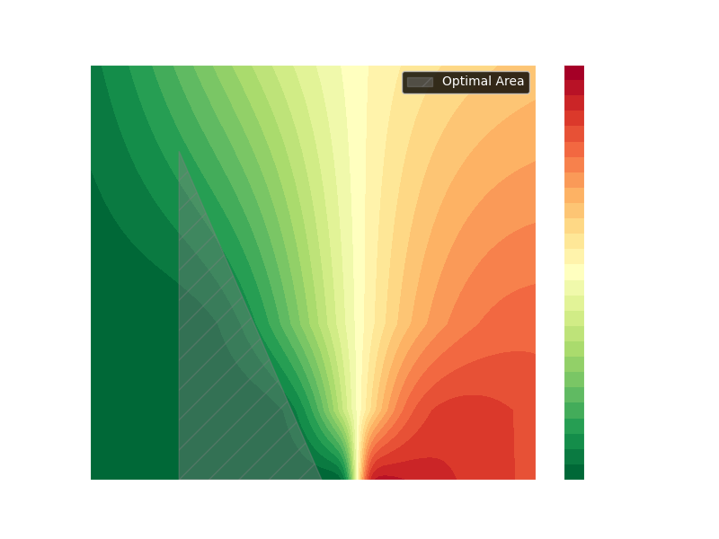

# Supply Chain Management

## Allgemeine Informationen

### Wichtige Informationen:

1 Periode = 5 Tage = 40 Stunden = 2400 Minuten

Statischer Wert des Inventars, daraus ergeben sich die Lagerkosten, welche Sprung fix sind.

Die benötigten Ressourcen, Kaufteile und Eigen Erzeugnisse.
Daraus ergibt sich ein Produktionsgraph, ein Gozinto Graph

### Wichtige Eingabe Daten je Periode:

Aktuelles Inventar und Aufträge, Vorhersage der Aufträge (bzw. ich weiß die genaue Zahl der
zukünftigen Nachfrage)

### Zwischen Berechnungen:

Aus Inventar und aufträge ergebende benötigte Produkte für nächste Periode ? Risiko

Was muss ich eingeben? Bzw. welche Dinge muss ich planen?

## Ausgangsdaten

### Produktionsstruktur

- **Endprodukte (Erzeugnisse):**
    - **P1:** Kinderfahrrad
    - **P2:** Damenfahrrad
    - **P3:** Herrenfahrrad
- **Zwischenprodukte / Baugruppen:**
    - Teilfertigungen, die als Zwischenstufen in der Produktion (z. B. Rahmen- und Radsätze)
      hergestellt werden.
    - Werden sowohl als eigenfertigte Produkte (E) als auch als Baugruppen in den Stücklisten
      aufgeführt.
- **Eigenfertigungsprodukte (E):**
    - 27 intern hergestellte Teile, die direkt in die Fertigung der Endprodukte eingehen.
- **Kaufteile (K):**
    - 29 von externen Lieferanten bezogene Teile.

- **Stücklisten der Endprodukte:**  
  Jede Endproduktdefinition (P1, P2, P3) enthält:
    - **Zwischenprodukte** (z. B. Baugruppen) und direkt verwendete Eigenfertigungsprodukte (E).
    - **Zuordnung der benötigten Kaufteile (K)** über die Stücklisten der Eigenfertigungsprodukte.
- **Werte der Teile:**
    - Jeder Artikel (Endprodukt, Zwischenprodukt, Eigenfertigungsprodukt, Kaufteil) hat einen
      zugeordneten **Wert** (Preis pro Stück).
    - Diese Werte fließen in die Herstellkosten- und Kostenkalkulation ein.

### Produktionskapazitäten und Kostenparameter

- **Arbeitsplätze:**
    - Teilefertigung: 5 Arbeitsplätze
    - Vormontage: 8 Arbeitsplätze
    - Endmontage: 1 Arbeitsplatz
- **Verfügbare Zeit pro Periode:**  
  (z. B. 2400 Minuten pro Periode, je nachdem wie viele Schichten und Überstunden man anordnet.

> Überstunden sind viel teurer als Schichten. Jede weiter Schicht ist teurer als bisher!
> Außerdem sind die Variablen machinenkosten fast immer billiger als Lohnkosten und die
> Fixenmaschinenkosten noch
> billiger.
> Kaufteile welche eine längere Bestellzeit haben sollte ich natürlich deutlich mehr einlagern.
> (Obwohl ich ja weiß wie viel in den nächsten Perioden benötigt wird; eigentlich sollte ich diese
> Info nicht haben; Bug
> im Programm)
> Lagerkosten sind sprungfix, also muss ich aufpassen nicht über disen Betrag zu kommen.

- **Rüstzeiten:**
    - Für jeden Arbeitsplatz sind feste Rüstzeiten vor Produktionswechseln definiert.
- **Kostenparameter:**
    - Lohn-/Maschinenkosten (variable und fixe Anteile)
    - Lagerhaltungskostensatz (z. B. 0,6 % pro Woche)
- **Anfangsbestände:**
    - Lagerbestände für Kaufteile, Eigenfertigungsprodukte (inkl. Zwischenprodukte) und Endprodukte
      sind vorgegeben.

## Periodenspezifische Daten

### Nachfrage / Primärbedarf

- **Verbindliche Verkaufsaufträge und Prognosen:**
    - Beispielwerte (Periode 1):
        - P1: 150 Stück
        - P2: 100 Stück
        - P3: 50 Stück
- **Abgleich mit Sicherheitsbeständen:**
    - Geplanter Lagerbestand am Periodenende (Sicherheitsbestand).

### Lagerbestand und Bestandsveränderungen

- **Lagerbestand Vorperiode:**
    - Aktuelle Bestände an Endprodukten, Zwischenprodukten und Kaufteilen.
- **Berechnung:**
  ```plaintext
  Neuer Lagerbestand = Alter Lagerbestand + Produktion – Verkäufe
  ```

- **Auswirkung:**
    - Bestimmt, ob zusätzliche Produktionsaufträge notwendig sind.

### Sekundärbedarf

- **Ermittlung über Stücklisten:**
    - Abgeleitet aus der Endproduktnachfrage wird der Bedarf an internen Fertigungsprodukten (E) und
    - **Zwischenprodukten/Baugruppen** berechnet.
- **Wertinformationen:**
    - Die Stücklisten enthalten auch die Werte der einzelnen Komponenten, die in die
      Herstellkostenkalkulation
      einfließen.

### Tertiärbedarf – Kaufteile

- **Ableitung aus den Stücklisten der Eigenfertigungsprodukte:**
    - Ermittelt, welche und in welcher Menge Kaufteile (K) benötigt werden.
- **Besonderheiten:**
    - Lieferzeiten und Lieferabweichungen müssen berücksichtigt werden.
    - Lagerbestand der Kaufteile ist abzufragen, um Überbestellungen zu vermeiden.

### Kapazitätsprüfung

- **Berechnung des Gesamt-Kapazitätsbedarfs:**
    - Zusammensetzung aus:
        - Produktionszeit (Fertigungszeit pro Stück)
        - Rüstzeiten (neu und aus Vorperioden)
        - Rückstände (Aufträge in Bearbeitung oder Warteschlange)
- **Verfügbare Kapazitäten:**
    - Stunden pro Arbeitsplatz und Schicht, Überstundenoptionen.
- **Ziel:**
    - Sicherstellen, dass die geplanten Produktionsaufträge innerhalb der verfügbaren Kapazitäten
      realisierbar sind.

---

## Berechnungen

### Materialbedarf

- **Endprodukte:**
    - Jedes Endprodukt (P1, P2, P3) besteht aus einer Kombination von Zwischenprodukten und
      Eigenfertigungsprodukten.
    - Die Stücklisten enthalten auch die benötigten Kaufteile.

Wir können die Stücklisten in einem Directed Acyclic Graph (DAG) darstellen, um die Abhängigkeiten
der Produkte darzustellen.

````mermaid
%%{init: {"themeVariables": {"fontSize": 16, "lineHeight": 1.1}}}%%
graph TD
%% Ebene 1: Endprodukte
    subgraph Level1[Endprodukte]
        direction LR
        P1
        P2
        P3
    end

%% Ebene 2: Herstellte Baugruppen
    subgraph Level2[Eigen Fabrikate 1]
        direction LR
        E1
        E2
    end

%% Ebene 3: Unterbaugruppen
    subgraph Level3[Eigen Fabrikate 2]
        direction LR
        E11
        E12
        E13
    end

%% Ebene 4: Gekaufte Materialien
    subgraph Level4[Gekaufte Materialien]
        direction LR
        K1
        K2
        K3
    end

%% Abhängigkeiten der Endprodukte
    P1 -->|1x| E1
    P1 -->|3x| E11
    P2 -->|10x| E2
    P3 -->|2x| E2
    P3 -->|2x| K3
%% Abhängigkeiten der Baugruppen
    E1 -->|3x| E11
    E2 -->|2x| E12
    E2 -->|4x| E13
    E2 -->|1x| K3
%% Abhängigkeiten der Unterbaugruppen
    E11 -->|1x| K1
    E11 -->|2x| K2
    E12 -->|8x| K2
    E13 -->|1x| K3
%% Klassen-Definition für Gekaufte Materialien (Dark Theme)
    classDef bought stroke: yellow, stroke-width: 2px;
    class K1 bought;
    class K2 bought;
    class K3 bought;
    classDef product stroke: green, stroke-width: 2px;
    class P1 product;
    class P2 product;
    class P3 product;
````

#### Einleiung

Eine Stückliste (Bill of Materials, BOM) kann als gerichteter azyklischer Graph (DAG) dargestellt
werden. Dabei repräsentieren die Knoten die einzelnen **Produkte**, **Eigenfabrikate**
und **Kaufteile** (zusammenfassend als **Komponenten** bezeichnet). Die gerichteten Kanten zwischen
den
Knoten geben an, welche Komponenten zur Herstellung einer übergeordneten Komponente benötigt werden.
Jeder Kante ist eine **Menge** $q$ zugeordnet, die angibt, wie viele Einheiten der
untergeordneten Komponente benötigt werden.

#### Mathematische Herleitung

Sei $ P $ ein Endprodukt und $ X $ eine beliebige Komponente (Eigenfabrikat oder Kaufteil). Die
gesamte benötigte Menge von $ X $ ergibt sich aus der Summe der Mengen,
die auf allen möglichen **Pfade** von $ P $ zu $ X $ benötigt werden.
Jeder einzelne Pfad $ p $ von $ P $ nach $ X $ trägt
dabei mit folgender Berechnung zur Gesamtmenge bei:

$$
\text{Total}_p(X) = \prod_{(i \rightarrow j) \in p} q_{ij}
$$

Die gesamte benötigte Menge von $ X $ ist dann:

$$
\text{Total}(X) = \sum_{p \in \text{Pfade}(P \rightarrow X)} \text{Total}_p(X)
$$

Das bedeutet: Für jede einzelne **Komponente** summieren wir über alle möglichen Produktionspfade
hinweg das Produkt der aufeinanderfolgenden Mengen entlang der Kanten.

---

#### Produkt Materialanforderungen

Wir verwenden eine rekursive Methode zur Berechnung des gesamten Materialbedarfs einer Komponente,
indem wir den Graphen von oben nach unten durchlaufen. Jeder Knoten multipliziert seinen aktuellen
Bedarfsfaktor mit der benötigten Menge seiner untergeordneten Komponenten.

##### Python-Implementierung

```python
def compute_requirements(component, multiplier):
    """
    Berechnet den gesamten Materialbedarf für eine gegebene Komponente.

    :param component: Die aktuelle Komponente (Produkt, Eigenfabrikat oder Kaufteil)
    :param multiplier: Die Menge, die von dieser Komponente benötigt wird
    :return: Ein Dictionary mit der Gesamtmenge jeder benötigten Komponente
    """
    requirements = {}

    # Wenn die Komponente keine weiteren Abhängigkeiten hat (also ein Kaufteil ist)
    if component.is_leaf():
        requirements[component] = multiplier
        return requirements

    # Iteriere über alle abhängigen Komponenten
    for child, amount in component.children:
        quantity = multiplier * amount
        child_requirements = compute_requirements(child, quantity)

        # Aggregiere die Anforderungen
        for item, count in child_requirements.items():
            requirements[item] = requirements.get(item, 0) + count

    return requirements
```

---

#### Gesamtbedarfs für Produktionsplan

Ein **Produktionsplan** gibt an, wie viele Einheiten jedes Endprodukts produziert werden sollen. Um
den gesamten Materialbedarf für die geplante Produktion zu berechnen, iterieren wir über alle
Endprodukte und summieren die berechneten Anforderungen.

##### Python-Implementierung

```python
def compute_total_requirements(production_plan):
    """
    Berechnet den gesamten Materialbedarf für einen Produktionsplan.

    :param production_plan: Dictionary mit Endprodukten und geplanten Produktionsmengen
    :return: Dictionary mit der Gesamtmenge jeder benötigten Komponente
    """
    total_requirements = {}

    for product, planned_quantity in production_plan.items():
        # Berechne Anforderungen für das einzelne Endprodukt
        requirements = compute_requirements(product, planned_quantity)

        # Summiere die Mengen für alle Komponenten auf
        for component, amount in requirements.items():
            total_requirements[component] = total_requirements.get(component, 0) + amount

    return total_requirements
```

---

#### Materialbedarf bei vorhandenem Lagerbestand

Neben den berechneten Anforderungen aus dem Produktionsplan gibt es auch einen **Lagerbestand**, der
angibt, wie viele Einheiten jeder Komponente bereits verfügbar sind. Um zu bestimmen, wie viel
zusätzlich produziert oder eingekauft werden muss, vergleichen wir die berechneten *
*Gesamtanforderungen** mit dem vorhandenen Bestand.

##### Vorgehensweise

1. Berechne mit `compute_total_requirements` den gesamten Materialbedarf für den Produktionsplan.
2. Vergleiche den berechneten Bedarf mit dem vorhandenen Lagerbestand.
3. Falls der Lagerbestand eine Komponente bereits abdeckt, wird diese nicht weiter produziert oder
   gekauft.
4. Falls der Lagerbestand nicht ausreicht, wird die Differenz als **tatsächlicher Produktions- oder
   Beschaffungsbedarf** gespeichert.

##### Python-Implementierung

```python
def compute_production_needs(production_plan, inventory):
    """
    Berechnet den Produktions-, Bestellbedarfs basierend auf dem Produktionsplan und Lager.

    :param production_plan: Dictionary mit geplanten Produktionsmengen für Endprodukte
    :param inventory: Dictionary mit der vorhandenen Menge jeder Komponente im Lager
    :return: Dictionary mit der zusätzlichen Menge, die produziert oder eingekauft werden muss
    """
    total_requirements = compute_total_requirements(production_plan)
    production_needs = {}

    for component, required_amount in total_requirements.items():
        stock = inventory.get(component, 0)

        # Falls Lagerbestand reicht, Bedarf = 0
        production_needs[component] = max(required_amount - stock, 0)

    return production_needs
```

---

#### Fazit

Mit diesem Ansatz kann für einen gegebenen Produktionsplan der **exakte Materialbedarf** für alle
Komponenten berechnet werden. Zudem kann durch den Abgleich mit dem Lagerbestand bestimmt werden,
**wie viel tatsächlich hergestellt oder beschafft** werden muss.

**Vorteile dieser Methode:**

- Berücksichtigt verschachtelte Stücklisten (mehrstufige BOMs)
- Aggregiert Materialanforderungen über verschiedene Endprodukte hinweg
- Verhindert Überproduktion durch Einbezug des Lagerbestands
- Nutzt eine rekursive Implementierung zur einfachen Verarbeitung des BOM-Graphs

Dieser Algorithmus ist essenziell für die **Produktionsplanung**,
**Materialdisposition** und **Lageroptimierung** in Fertigungsunternehmen. 🚀

### Workstation-Kapazitäten

#### 1. Definition der Variablen

Ein Produkt **$p$** wird nicht an einer einzigen Workstation gefertigt, sondern kann mehrere **Bearbeitungsschritte** durchlaufen. Jeder dieser Schritte wird an einer bestimmten **Workstation (ws)** durchgeführt.

Jede Workstation **$ws$** ist dabei mit einer spezifischen **Rüstzeit ($rt$) und Bearbeitungszeit ($pt$) pro Einheit** verbunden.

Für ein Produkt $p$ gibt es eine **Sequenz von Arbeitsschritten**, wobei jeder Arbeitsschritt an einer bestimmten Workstation $ws$ durchgeführt wird:

$$
S(p) = \{(ws_1, rt_1, pt_1), (ws_2, rt_2, pt_2), \dots, (ws_n, rt_n, pt_n) \}
$$

wobei:
- $S(p)$ die Menge aller Bearbeitungsschritte für Produkt $p$ ist.
- Jeder Schritt ein Tupel $(ws, rt, pt)$ ist:
    - $ws$: Die Workstation, die den Schritt ausführt.
    - $rt$: Die für diesen Schritt benötigte Rüstzeit (fix, unabhängig von der Produktionsmenge).
    - $pt$: Die Bearbeitungszeit pro Einheit des Produkts an dieser Workstation.

Die benötigte **Kapazität einer einzelnen Workstation $ws$** für ein Produkt $p$ ergibt sich aus:

$$
T(ws, p) = rt(ws, p) + q_p \cdot pt(ws, p)
$$

wobei:
- $q_p$ die Produktionsmenge des Produkts $p$ ist.
- $T(ws, p)$ die gesamte benötigte Kapazität für dieses Produkt an dieser Workstation ist.

---

#### 2. Berechnung der Gesamtbelastung einer Workstation

Da eine Workstation mehrere Produkte bearbeitet, summieren wir die Kapazität über alle Produkte, die an dieser Workstation gefertigt werden müssen:

$$
\text{Kapazität}(ws) = \sum_{p \in P} \sum_{(ws', rt, pt) \in S(p)} \mathbb{1}_{ws' = ws} \cdot \left( rt + q_p \cdot pt \right)
$$

wobei:
- $\mathbb{1}_{ws' = ws}$ eine Indikatorfunktion ist, die 1 ist, wenn der Bearbeitungsschritt an Workstation $ws$ durchgeführt wird, sonst 0.
- $P$ die Menge aller zu produzierenden Produkte ist.
- $\text{Kapazität}(ws)$ die gesamte benötigte Kapazität der Workstation $ws$ ist.

Dies stellt sicher, dass jede Workstation **die Belastung aus allen Bearbeitungsschritten aller Produkte** korrekt summiert.

---

#### 3. Berücksichtigung von Lieferverzögerungen bei Kaufteilen

Falls für ein Produkt $p$ Kaufteile benötigt werden, kann deren verspätete Lieferung zu einer Kapazitätsminderung führen. Jede Kaufteil-Lieferung besitzt:
- Eine **erwartete Lieferzeit** $\ell_k$
- Eine **Lieferzeitabweichung** $\sigma_k$

Falls ein Kaufteil $k$ an einer Workstation $ws$ benötigt wird, reduziert sich die verfügbare Kapazität:

$$
\text{Effektive Kapazität}(ws) = \text{Kapazität}(ws) - \sum_{k \in K(ws)} \sigma_k
$$

wobei:
- $K(ws)$ die Menge aller Kaufteile ist, die an Workstation $ws$ benötigt werden.
- $\sigma_k$ die Abweichung der Lieferzeit für das Kaufteil $k$ ist.

---

#### 4. Optimierung der Kapazitätsplanung durch Schichten & Überstunden

Da wir keine Bearbeitungsreihenfolge festlegen, steuern wir die Kapazitäten durch:
- **Anzahl der Schichten**: $s_{max}$
- **Maximale Überstunden pro Schicht**: $o_{max}$

Die maximale verfügbare Kapazität einer Workstation beträgt:

$$
\text{Maximale Kapazität}(ws) = 24h
$$

Anpassung der effektiven Kapazität an die maximal mögliche Kapazität:

$$
\text{Finale Kapazität}(ws) = \min(\text{Effektive Kapazität}(ws), \text{Maximale Kapazität}(ws))
$$

> Die Finale Kapazität ist nicht unbedingt die optimale Kapazität

---

#### 5. Gesamtmodell

Die Berechnung der Workstation-Kapazitäten erfolgt in folgenden Schritten:

1. **Bestimmung der Belastung jeder Workstation durch die Produktion**  
   $$
   \text{Kapazität}(ws) = \sum_{p \in P} \sum_{(ws', rt, pt) \in S(p)} \mathbb{1}_{ws' = ws} \cdot \left( rt + q_p \cdot pt \right)
   $$

2. **Abzug von Lieferverzögerungen der Kaufteile**  
   $$
   \text{Effektive Kapazität}(ws) = \text{Kapazität}(ws) - \sum_{k \in K(ws)} \sigma_k
   $$

3. **Kapazitätsbegrenzung durch verfügbare Schichten und Überstunden**  
   $$
   \text{Begrenzte Kapazität}(ws) = \min(\text{Effektive Kapazität}(ws), s_{max} \cdot 8h + o_{max})
   $$

4. Kapazitätsminimum:
    Es muss mindestens eine Schicht je Workstation geben, also:
    $$
    \text{Finale Kapazität}(ws) = \max(\text{Begrenzte Kapazität}(ws), 8h)
    $$
---

#### 6. Fazit

##### Vorteile dieses Modells:
✅ Berücksichtigt **mehrstufige Produktionsprozesse**, in denen ein Produkt mehrere Workstations durchläuft.  
✅ Aggregiert **alle Produkte**, die an einer Workstation gefertigt werden, um die Gesamtauslastung zu berechnen.  
✅ Bezieht **Lieferverzögerungen von Kaufteilen** mit ein, um realistische Kapazitätsplanungen zu ermöglichen.  
✅ Ermöglicht **Anpassung der Kapazitäten** durch Schichtmodelle und Überstunden.

Dieses Modell stellt eine **robuste Grundlage für die Kapazitätsplanung und Kostenoptimierung** in einem Produktionssystem dar. 🚀
Damit haben wir die Kapazität , welche für das gegebenen Material und Produktionsplans benötigt wird und möglich ist( Begrenzung durch maximale Kapazität)


### Personal und Maschinenkosten


## Schritt-für-Schritt-Planungsablauf

### Primärbedarf ermitteln:

- Einlesen der Verkaufsaufträge und Prognosen.
- Berechnung des Bedarfs an Endprodukten (P1, P2, P3) unter Abzug des vorhandenen Lagerbestands.

### Bestandsprüfung:

- Abgleich des vorhandenen Lagerbestands (Vorperiode) mit dem Bedarf.
- Festlegung des Soll-Lagerbestands (Sicherheitsbestand).

### Berechnung des Sekundärbedarfs

- Auswertung der Stücklisten der Endprodukte.
- Ermittlung des Bedarfs an Eigenfertigungsprodukten und Zwischenprodukten.
- Berücksichtigung der Werte der einzelnen Komponenten zur späteren Kostenkalkulation.

### Berechnung des Tertiärbedarfs

- Ableitung der benötigten Kaufteile aus den Stücklisten der internen Fertigungsprodukte.
- Abgleich mit vorhandenen Beständen und Ermittlung von Bestellmengen unter Berücksichtigung von
  Lieferzeiten.

### Kapazitätsprüfung:

- Ermittlung des Gesamt-Kapazitätsbedarfs (Produktionszeit + Rüstzeiten + Rückstände).
- Vergleich mit den verfügbaren Kapazitäten der Arbeitsplätze.
- Falls Engpässe vorliegen: Priorisierung und ggf. Verteilung der Aufträge über mehrere Perioden.

### Erstellung der Produktions- und Bestellaufträge:

- Festlegung der **Produktionsaufträge** für Endprodukte sowie für Zwischen- und
  Eigenfertigungsprodukte.
- Ableiten von **Bestellaufträgen** für Kaufteile.
- Zusammenführung aller Aufträge und Festschreibung der geplanten Produktion.

### Kalkulation und Dokumentation:

- Berechnung der Herstellkosten unter Einbeziehung:
    - Materialwerte (aus Stücklisten, inkl. Zwischenprodukte)
    - Fertigungs- und Rüstzeiten (Arbeits- und Maschinenkosten)
    - Lagerhaltungskosten (auf Basis des Lagerwerts)
- Speicherung der **geplanten Produktionsaufträge**, der **Bestellaufträge** sowie der **erwarteten
  Lagerbestände**
  als Eingangsgrößen für die nächste Periode.

---

## Datenfluss im Planungsprogramm

1. **Eingabe:**
    - **Stammdaten:** Produktionsstruktur, Stücklisten (mit Mengen und Werten), Kapazitätsdaten,
      Anfangslagerbestände.
    - **Periodenspezifische Daten:** Verkaufsaufträge, Prognosen, Rückstände, Bestände, offene
      Fertigungsaufträge.

2. **Berechnungsmodul:**
    - Ermittlung von Primär-, Sekundär- und Tertiärbedarf.
    - Kapazitätsplanung (inkl. Rüstzeiten und Überstunden).
    - Kostenkalkulation (Materialwerte, Produktionszeiten, Lagerhaltung).

3. **Ausgabe:**
    - Produktionsplan: Welche Endprodukte, Zwischenprodukte und Eigenfertigungsprodukte in welcher
      Menge hergestellt
      werden.
    - Bestellplan: Welche Kaufteile in welcher Menge bestellt werden müssen.
    - Aktualisierte Lagerbestände und Kapazitätsauslastungen.
    - Kalkulierte Herstellkosten und Vergleich Soll/Ist (über Formularvorlagen).

### Vereinfachtes Modell wenn man nur eine Periode planen würde

Und man das Lager nicht optimiert;

```mermaid
flowchart TD
%% Stammdaten (konstant)
    subgraph "Stammdaten"
        PRODSTR["Produktionsstruktur"]
    end

%% Periodendaten (variabel)
    subgraph "Periodendaten"
        OPEN_SALES["Offene Aufträge"]
        SALES["Neue Aufträge"]
        CURINV["Lagerbestand"]
    end

%% Berechnungen
    subgraph "Berechnungen"
        PRIM["Primärbedarf"]
        SEK["Sekundärbedarf"]
    end

%% Ergebnis
    subgraph "Ergebnis"
        PRODORD["Produktionsaufträge"]
        BESTORD["Bestellaufträge"]
    end

%% Datenfluss
    SALES --> PRIM
    OPEN_SALES --> PRIM
    CURINV --> PRIM
    PRODSTR --> SEK
    PRIM --> SEK
    SEK --> BESTORD
    SEK --> PRODORD
class PRODSTR, TEILDAT, CAPCOST, SALES, OPEN_SALES, CURINV inputData;
class PRIM, NET, SEK, TER, PRODORD, BESTORD, NEWINV calcData;
class RES resultData;
classDef inputData fill: #223;
classDef calcData fill: #333;
classDef resultData fill: #232;

````

## Wichtiges zur Optimierung

### Lagerkosten:

- Lagerkosten sind sprungfix, also muss ich aufpassen nicht über disen Betrag(250 000) zu kommen.
- Ich kann die Lagerkosten nicht genau planen, da es Lieferabweichungen gibt und die Bestellungen zu
  zufälligen Zeiten
  eintreffen ?
- Werden die Lagerkosten über die durchschnittlische Lagermenge berechnet? Oder zahle ich die
  spungfixen Kosten wenn
  Lager kurze Zeit zu voll ist?
- Risiko dafür berechnen, dass Lager zu voll. Risiko Lagerwert > 250 k. Risiko sollte unter 10%
  sein;
- Durch Eilbestellungen niedrigeres Risiko, aber höhere Bestellkosten.
- Kaufteile mit größten Abweichungen führen zu höheren Risiken.
- Von Kaufteilen mit langer Lieferzeit mehr im Lager haben. Von Kaufteilen mit hoher Abweichung mehr
  auf Lager haben.
- Teile welche für mehrere Endprodukte benötigt werden, mehr auf Lager haben.

#### Lagerkosten Funktion

$$
f(x) =
\begin{cases}
0.006 \cdot x, & x < 250\,000 \\
5\,000 + 0.012 \cdot x, & x \geq 250\,000
\end{cases}
$$



#### Erwartungswert des Lagerwertes

Der Lagerwert kann nicht genau hervorgesagt werden. Es gibt Unsicherheiten in den Bestellungen.
Wir definieren den Lagerwert $X$ als normalverteilte Zufallsvariable mit Erwartungswert $e$ und
Standardabweichung $sd$.

Aus den genannten Lagerkostenfunktion und der genannten Verteilung des Lagerwertes können wir eine
erwartete
Kostenwertfunktion
$f(X)$ ableiten.
muss der Erwartungswert in zwei Bereiche aufgeteilt werden:

$$
E[f(X)] = E[0.006X \mid X < 250 \cdot e^{3}] \, P(X < 250 \cdot e^{3}) + E[5000 + 0.012X \mid X \geq 250 \cdot e^{3}] \, P(X \geq 250 \cdot e^{3})
$$

was sich vereinfacht zu:

$$
E[f(X)] = 0.006 \cdot E[X \mid X < 250 \cdot e^{3}] \, P(X < 250 \cdot e^{3}]) + \Bigl(5000 + 0.012 \cdot E[X \mid X \geq 250\cdot e^{3}]\Bigr) \, P(X \geq 250\cdot e^{3})
$$

wobei:

- $P(X \geq 250\,000)$ die Wahrscheinlichkeit ist, dass der Speicherkapazitätswert den Schwellenwert
  überschreitet.
- $E[X \mid X \geq 250\,000]$ und $E[X \mid X < 250\,000]$ die bedingten Erwartungswerte von $X$
  oberhalb bzw. unterhalb
  des Schwellenwerts sind.

#### Berechnung der Wahrscheinlichkeit $P(X \geq 250\,000)$

Da $X \sim N(e, sd^2)$, berechnet man:

$$
P(X \geq 250\,000) = 1 - \Phi\Bigl(\frac{250\,000 - e}{sd}\Bigr)
$$

wobei $\Phi$ die kumulative Verteilungsfunktion (CDF) der Standardnormalverteilung ist.

#### Berechnung der beschnittenen Erwartungswerte

Mit Hilfe der Eigenschaften der **beschnittenen Normalverteilung** lassen sich die Erwartungswerte
wie folgt ableiten:

$$
E[X \mid X < 250\,000] = e - sd \, \frac{\phi(z)}{\Phi(z)}
$$

$$
E[X \mid X \geq 250\,000] = e + sd \, \frac{\phi(z)}{1 - \Phi(z)}
$$

wobei:

- $z = \frac{250\,000 - e}{sd}$
- $\phi(z)$ die Dichtefunktion (PDF) der Standardnormalverteilung ist
- $\Phi(z)$ die kumulative Verteilungsfunktion (CDF) der Standardnormalverteilung darstellt

#### Berechnung der erwarteten Speicherpreis

Setzt man nun alles zusammen:

$$
E[f(X)] = 0.006 \Bigl(e - sd \, \frac{\phi(z)}{\Phi(z)}\Bigr) \, \Phi(z) + \Bigl(5000 + 0.012 \Bigl(e + sd \, \frac{\phi(z)}{1 - \Phi(z)}\Bigr)\Bigr) \, (1 - \Phi(z))
$$

#### Lagerkosten Berechnung

Für einen erwarteten Lagerwert von $e$ und einer Standardabweichung von $sd$ ergibt sich der
Erwartungswert der
Lagerkosten

$$
E[f(X)] = 0.006\Bigl(e - sd\frac{\phi(z)}{\Phi(z)}\Bigr)\Phi(z) + \Bigl(5000+0.012\Bigl(e+ sd\frac{\phi(z)}{1-\Phi(z)}\Bigr)\Bigr)(1-\Phi(z))
$$

wobei
$$
z=\frac{250000-e}{sd}\quad\text{und}\quad sd=r\cdot e.
$$

##### Graph für ausgewählte Abweichungen



Für ausgewählte Abweichungen $sd=0.05e$, $sd=0.1e$ und $sd=0.25e$; Diese wurden einfach für diesen
Graphen ausgewählt
und
haben keine spezielle Bedeutung. Die wirklichen Abweichungen ergeben sich aus den Lieferer
Zeitenabweichungen.
Die Berechnung der genauen Abweichung für eine Periode ist kompliziert.

Unter der Betrachtung, dass eine Abweichung von unter 10% realistisch ist, wäre es wahrscheinlich am
Besten,
mit einem Lagerwert von 230 000 zu planen.
Ein zu kleiner Lagerwert würde dazu führen, dass wir zu iel für die fix Kosten der Maschinen zahlen.
Daher muss der Lagerwert optimiert werden.

##### Color Map Standard Deviation, Erwartungswert

Die erwarteten Lagerkosten berechnen sich aus Erwartungswert und Standardabweichung der Erwartung.
Dies
können wir nicht in einem normalen 2d Plot darstellen. Daher verwenden wir eine Color Map, um die
erwarteten
Lagerkosten für verschiedene Erwartungswerte und Standardabweichungen darzustellen.

$$ e = \text{erwartete Lagerkosten}$$
$$ sd = Standardabweichung $$
$$ESC(e, sd) = \text{Erwartete Lagerkosten } (\textit{expected storage cost})$$
somit ist:
$$ \frac{ESC(e, sd)}{e} = \text{relative erwartete Lagerkosten} $$
Wahrscheinlich ist es am besten mit einem $e$ und $sd$ zu planen, bei
dem $\frac{ESC(e, sd)}{e} < 0.01$
Dies ist ungefähr in der Abbildung gezeigtem Dreieck der Fall:

Dreieck:
$$ e = 200 \cdot e^3\, sd=001$$
$$ e = 200 \cdot e^3\, sd=0.20$$
$$ e = 240 \cdot e^3\, sd =0.01$$

| Erwartungswert $e$ | $sd=0.05e$ | $sd=0.1e$ | $sd=0.25e$ |
|--------------------|------------|-----------|------------|
| 200k               | 1 200      | 1 200     | 2 200      |
| 225k               | 1 400      | 2 000     | 3 500      |
| 250k               | 5 000      | 5 000     | 5 000      |
| 275k               | 8 000      | 7 000     | 6 000      |
| 300k               | 8 600      | 8 000     | 7 500      |

**Relative Kosten**:

| Erwartungswert $e$ | $sd=0.05e$ | $sd=0.1e$ | $sd=0.25e$ |
|--------------------|------------|-----------|------------|
| 200k               | 0,6%       | 0,6%      | 1,1%       |
| 225k               | 0,6%       | 0,9%      | 1,6%       |
| 250k               | 2,0%       | 2,0%      | 2,0%       |
| 275k               | 2,9%       | 2,6%      | 2,2%       |
| 300k               | 2,9%       | 2,7%      | 2,5%       |

### Primärbedarf

Der Primärbedarf berechnet sich sehr einfach aus den Verkaufsaufträgen und den offenen Aufträgen.
Wie optimiert man den Primärbedarf? Sollte man immer genau so viel produzieren wie beauftragt wird.
Es könnte durchaus Sinn machen mehr zu produzieren vorallem wenn das Inventar niedrig ist und es
wenig Bestellungen
gibt.
Da man so schon für die nächste Periode produziert hat. Dies führt zu komplizierten Berechnungen.
Man sollte weniger produzieren als bestellt wurde, wenn bei weiterer Produktion die Kosten anfangen
höher zu sien als
der Verkaufswert.

Dadurch dass es nur drei Produkte gibt, somit hier nur 3 Variblen, kann man ziemlich einfach
optimieren.
Wenn man die andeen Werte auds dem Primärbedarf berechnen kann. Dann kann ich ja einfach:
Bei Basislösung
$$x_0; y_0; z_0$$
Nächste Lösung berechnen in dem ich das Maximum aller Möglichkeiten nehme eins der Werte +1 oder -1
zu rechnen.
Das sind zum Glück nur 6 Möglichkeiten. Dann dies höchstens 3_000 wiederholen, da Werte im Spiel
keinesfalls über 1000
liegen.
$$ x+1 \, y\, z$$

### Sekundärbedarf

Der Sekundärbedarf wird ganz einfach berechnet. Dort gibt es nicht zu optimieren. Die Frage ist ob
es Sinn machen kann
mehr von etwas zu produzieren was man aber garniucht direkt benötigt.
Je nach Rüstzeiten und Kosten kann es durchaus Sinn machen mehr von einem Zwischenprodukt zu
produzieren. Vorallem wenn
dies
von mehreren Endprodukten benötigt wird. Oder Rüstzeiten an Maschine hoch sind. Diese Periode eine
geringe Auslastung
ist und im Lager noch Platz ist.

### Tertiärbedarf - Kaufteile

Die Kaufteile sind ziemlich kompliziert zu optimieren. Je nachdem kann es durchaus Sinn ergeben mehr
zu Kaufen als
direkt benötigt wird. Vorallem wenn Lager Platz hat und Lieferzeiten große Abweichungen haben.
Außerdem ist es wichtig
10% Rabatt zu bekommen durch die Bestellte Menge. Sodass man prinzipiell einen Kostevorteil hat wenn
man mehr Bestellt.

### Benötigte Workstations

Aus Sekundärbedarf berechnet sich die Benötigten Arbeiten je Arbeitsstation Workstation

### Arbeitsschichten

Wie viele Schichten müssen für welche Workstations angeordnet werden?
Kann das klar berechnet werden? Also für festgelegte Produktionen, gibt es eine direkt zu
berechnende einfache optimale ?
Könnte es Sinn machen etwas zu produzieren aber dann nicht die Kapazität zu haben ?
Eher nicht.

### Maschinenkosten & Arbeitskosten

Aus den Arbeitsschichten und der Produktion berechnen sich die Arbeitskostren und die
Maschinenkosten. Diese sind sehr wichtig. Müssen auf jedenfall optimiert werden.
Also wenn Kosten zu hoch muss weniger produziert werden.
Nötige Kapazitäten sollten natürlich optimal genutzt werden. Weitere Schichten kosten deutlich mehr
als vorherige.

### Geplantes Inventar

Aus den KKaufteilen sowie dem geplanten Verbrauch ergibt sich natürlich ein Plan dafür wie viel das
Lager kosten wird

### Gesamt Kosten

Aus den Maschinenkosten, Arbeitskosten und Lagerkosten ergibt sich die Gesamtkosten. Diese sollten
natürlich minimiert werden.

### Erträge

Aus den Verkaufsaufträgen und den geplanten Produktionen ergibt sich der Ertrag.

### Gewinn

Der Gewinn ergibt sich aus den Erträgen abzüglich der Gesamtkosten.

### Flowchart Planung Optimiert

```mermaid
flowchart TD

%% Stammdaten (konstant)
    subgraph "Stammdaten"
        PRODSTR["Produktionsstruktur"]
    end

%% Periodendaten (variabel)
    subgraph "Periodendaten"
        OPEN_SALES["Offene Aufträge"]
        SALES["Neue Aufträge"]
        CURINV["Lagerbestand"]
    end

%% Berechnungen
    subgraph "Berechnungen"
        PRIM["Primärbedarf"]
        SEK["Sekundärbedarf"]
        WORKSTATION_REQ["Zeit je WS"]
        WORK_TIMES["WS Schichten"]
        WORK_COST["Personal Kosten"]
        MACHINE_COST["Machinen Kosten"]
        PLANNED_INV["Geplantes Inventar"]
        EXPECTED_INV_COST["Erwartete Lagerkosten"]
        TOTAL_COST["Gesamt Kosten"]
        REVENUE["Erträge"]
        EARNINGS["Gewinn"]
        PRODORD["Produktionsaufträge"]
        BESTORD["Bestellaufträge"]
    end

%% Datenfluss
    SALES --> PRIM
    OPEN_SALES --> PRIM
    CURINV --> PRIM
    PRODSTR --> SEK
    PRIM --> SEK
    PRODORD --> WORKSTATION_REQ
    PRODORD --> PLANNED_INV
    WORKSTATION_REQ --> WORK_TIMES
    WORK_TIMES --> WORK_COST
    WORK_TIMES --> MACHINE_COST
    PRIM --> REVENUE
    WORK_COST --> TOTAL_COST
    MACHINE_COST --> TOTAL_COST
    SEK --> BESTORD
    SEK --> PRODORD
    BESTORD --> PLANNED_INV
    PLANNED_INV --> EXPECTED_INV_COST
    EXPECTED_INV_COST --> TOTAL_COST
    REVENUE --> EARNINGS
    TOTAL_COST --> EARNINGS
class PRODSTR, TEILDAT, CAPCOST, SALES, OPEN_SALES, CURINV inputData;
class PRIM, NET, SEK, TER, PRODORD, BESTORD, NEWINV calcData;
class RES resultData;
classDef inputData fill: #223, stroke: #000, stroke-width: 2px, color: #fff;
classDef calcData fill: #333, stroke: #000, stroke-width: 2px, color: #fff;
classDef resultData fill: #232, stroke: #000, stroke-width: 2px, color: #fff;
````

Ist das ganze nicht ein lineares Optimierungsproblem?
mit Variablen und Bedingungen?
Sowie einer Zielfunktion!

Optimierungsproblem mit Variablen und Bedingungen, sollte man mit Google OR Tools lösen können.

## Python Implementierung

### Produktionsplanung

In diesem Modell gehen wir davon aus, dass unsere Produktionsstruktur (BOM – Bill of Materials) als
gerichteter azyklischer Graph (DAG) modelliert wird. Jeder Kante wird eine Menge zugeordnet, die
angibt, wie viele Einheiten einer untergeordneten Komponente benötigt werden. Alle Komponenten –
seien es Endprodukte, In-House-Products (Eigenfabrikate) oder PurchaseParts (Kaufteile) – werden
zusammenfassend als *Items* betrachtet.

#### Konzept

- **Item (Basisklasse):**  
  Enthält gemeinsame Attribute wie `id`, `value` und zusätzlich eine BOM-Struktur, dargestellt durch
  ein Attribut `children`.
    - **children:** Eine Liste von Tupeln `(child: Item, quantity: int)`.  
      Komponenten ohne weitere Abhängigkeiten (z.B. Kaufteile) haben keine Kinder.

- **Spezialisierungen:**
    - `EndProduct`: Repräsentiert das Endprodukt.
    - `InHouseProduct`: Repräsentiert intern hergestellte Produkte (Eigenfabrikate).
    - `PurchasePart`: Repräsentiert zugekaufte Teile mit zusätzlichen Attributen wie
      `discountQuantity`, `orderTime` und `orderTimeDeviation`.

- **Inventory:**  
  Ein `InventoryEntry` verbindet ein `Item` mit dem Lagerbestand. Die Klasse `Inventory` verwaltet
  diese Einträge (z.B. in einem Dictionary) und bietet Methoden wie `getQuantity` und
  `calculateTotalValue`.

- **PlanningData & PrimaryDemandCalculator:**  
  `PlanningData` enthält die periodenspezifischen Eingaben, z.B. einen Forecast für EndProducts und
  den aktuellen Lagerbestand. Der `PrimaryDemandCalculator` nutzt diese Daten, um den primären
  Bedarf zu ermitteln.

- **BOMCalculator:**  
  Hier werden die rekursiven Berechnungen des Materialbedarfs durchgeführt. Es kommen die folgenden
  Funktionen zum Einsatz:
    - `compute_requirements`: Berechnet den Bedarf für einen einzelnen Item-Knoten (rekursiv entlang
      der BOM).
    - `compute_total_requirements`: Aggregiert den Bedarf für alle EndProducts eines
      Produktionsplans.
    - `compute_production_needs`: Vergleicht den Gesamtbedarf mit dem Lagerbestand und ermittelt den
      zusätzlichen Produktions- bzw. Einkaufsbedarf.

### Aktualisiertes PlantUML-Diagramm

Siehe class_diagram.puml
