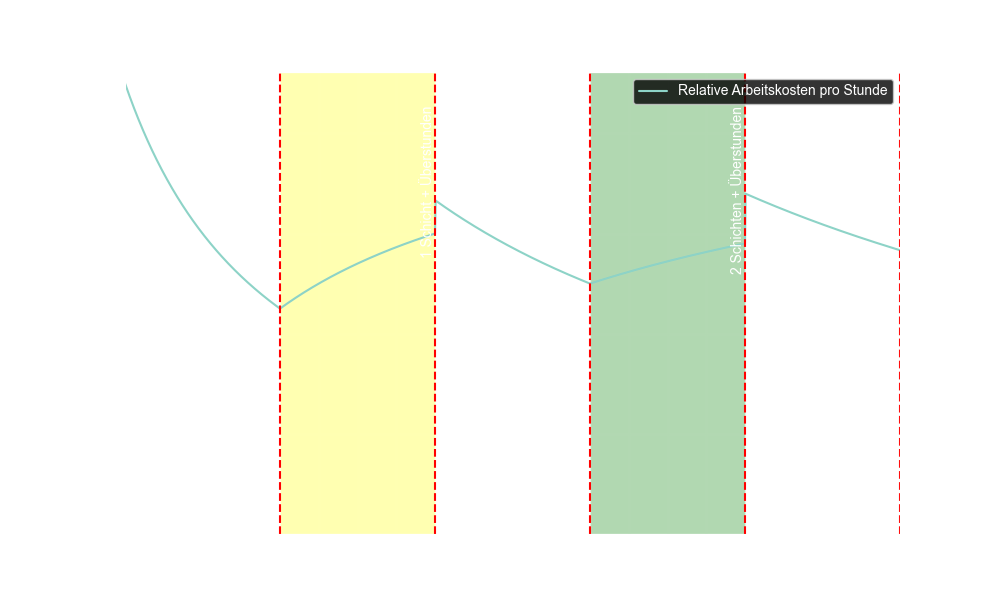

# Personal und Maschinenkosten

## Personalkosten

Bei festgelegten Workstation Kapazitäten können die Personalkosten einfach berechnet werden.
Funktionsweise der Schichten und Personalkosten.
Sei

- $B = 480$ Minuten, die Basisarbeitszeit pro Schicht, und
- $PCap_d(ws) \in [0,1440]$ die geplante Kapazität pro Tag in Minuten für eine Workstation $ws$

### Anzahl Schichten

$$
s(ws) = \max\Big(\min\Big(round(\frac{PCap_d(ws)}{B}),\, 3\Big),\, 1\Big)
$$

Dabei gilt:

- $round(X)$ rundet den Quotienten nach round to nearest, ties to zero.
- Durch $\min(\cdot,\, 3)$ wird sichergestellt, dass maximal 3 Schichten verwendet werden.
- Durch $\max(\cdot,\, 1)$ wird garantiert, dass mindestens 1 Schicht vorliegt.

$$
s(ws) \in \{1, 2, 3\}
$$
### Anzahl Überstunden

Die Anzahl der Überstunden pro Tag $O_d$ berechnet sich dann als Differenz zwischen der geplanten
Kapazität und der Basiskapazität der ermittelten Schichten:

$$
O_d(ws) = \max\Big(PCap_d(ws) - s(ws) \cdot B,\, 0\Big)
$$

Diese mathematische Darstellung erlaubt es, aus einer vorgegebenen Tageskapazität $Cap_d$ die nötige
Anzahl an Schichten $s$ sowie den Umfang der Überstunden $O_d$ zu berechnen.

!!! important
    Es gibt für jede Workstation unterschiedliche Kosten

---

### Lohnsätze

Um die Personalkosten für jede Workstation zu berechnen, benötigen wir folgende Informationen:

- $L_1(ws) \equiv \text{Lohnsatz der 1. Schicht der Workstation ws}$
- $L_2(ws) \equiv \text{2. Schicht}$
- $L_3(ws) \equiv \text{3. Schicht}$
- $L_O=(ws) \equiv \text{Lohnsatz für Überstunden an ws}$

$$
L_1(ws),\, L_2(ws),\, L_3(ws),\, L_o(ws) \in \mathbb{Q}^{+}
$$

### Formel für Lohnkosten

Die Lohnkosten hängen von der Anzahl der eingesetzten Schichten ab, da jede Schicht einen
unterschiedlichen Lohnsatz hat:

Je nach Anzahl der Schichten ergibt sich der reguläre Lohnkostenblock: 
(**L**abour cost per **d**ay)

$$
C_{L}(ws) = L_o(ws) \cdot O_d(ws) +
\begin{cases}
L_1(ws) \cdot B& s(ws) = 1 \\
L_1(ws) \cdot B + L_2(ws) \cdot B, & s(ws) = 2 \\
L_1(ws) \cdot B + L_2(ws) \cdot B + L_3(ws) \cdot B, & s(ws) = 3
\end{cases}
$$

### Diagramm der relativen Personalkosten

## Maschinenkosten

### Kapazitätsauslastung
- $M_{used}(ws) \equiv \text{produktiv genutzten Minuten(Bearbeitungszeit)}$
- $M_{total}(ws) \equiv \text{eingeplante Kapazität (Schichten + Überstunden)}$
- $M_{total}(ws) = s(ws) \cdot B + O_d(ws)$

!!! note Auslastung
    Wenn eine Workstation vollständig genutzt wird, beträgt die Auslastung **100 %** $(= 1)$. Liegt sie
    darunter, entstehen **Leerkosten**.

### Variable Maschinenkosten

Die **variablen Maschinenkosten** fallen nur für produktiv genutzte Minuten an:

$$
C_{Mvar}(ws) = M_{used}(ws) \cdot c_{Mvar}(ws)
$$

wobei:

- $c_{Mvar}(ws)$ die variablen Maschinenkosten pro Minute sind.
- $M_{used}(ws)$ die Minuten, in denen tatsächlich produziert wird.

!!! note
    Variable Maschinenkosten entstehen **nur dann**, wenn produziert wird. Falls eine Workstation eine
    Schicht eingeplant hat, aber keine Produktion stattfindet, sind die variablen Maschinenkosten **0**.

### Fixe Maschinenkosten

Die **fixen Maschinenkosten** fallen an für Leerzeiten innerhalb der .

$$
C_{Mfix}(ws) = M_{total}(ws) - M_{used}(ws) \cdot c_{Mfix}(ws)
$$

wobei:

- $M_{total}(ws) = s(ws) \cdot B + O_d(ws)$ die gesamte geplante Kapazität ist.
- $c_{Mfix}(ws)$ die fixen Maschinenkosten pro Minute sind.

### Gesamt Masschinenkosten

Die Gesamtkosten für jede Workstation $ws$ setzen sich zusammen aus:

$$
C_M(ws) = C_{Mvar}(ws) + C_{Mfix}(ws)
$$

## Gesamtkosten pro Workstation

Die Gesamtkosten für eine Arbeitsstation berechnen sich aus der Summe der Lohn- und Maschinenkosten:

$$
C_{total}(ws) = C_L(ws) + C_M(ws)
$$

!!! note
    Wenn wir eine Zeit PCap_d(ws) für eine Workstation ws planen, heißt dass nicht das die Workstation
    auch wirklich diese Zeit genutzt wird. Die tatsächliche Nutzung kann von der geplanten Zeit abweichen.
    Aus dem Grund das benötigte Materialien fehlen

### Vereinfachte Berechnung
Die Gesamte Maschinenzeit für eine Workstation ist, die gesamt angeordnete Arbeitszeit.

$$
M_{total}(ws) = s(ws) \cdot B + O_d(ws)
$$

Wir können davon ausgehen, dass die geplante Kapazität $PCap_d(ws)$ auch produktiv verwendet wird.
Also:

$$
M_{used}(ws) = PCap_d(ws)
$$

Damit können wir die gesamten Kosten für eine workstation aus den statischen Lohnsatz Daten und der
geplante / benötigten Kapazität berechnen.

### Diagramm vereinfachte Kosten

!!! note
    In unserem Modell sind die Lohnkosten bei allen Arbeitsstationen gleich. Die Maschinenkosten
    variieren jedoch je nach Workstation.

#### Für Workstation mit durchschnittlichen Lohnsätzen

!!! important
    Die Grafik startet erst bei 4 Stunden aus Skalierungszwecken. Bei weniger als 4 Stunden
    steigen die Kosten exponentiell bei Näherung zu 0.

#### Für Workstation mit höchsten Maschinensätzen

### Arbeitstationen Kostenvergleich
Alle Arbeitsstationen haben bei uns die selben Lohnsätze, jedoch unterschiedliche Maschinenkosten.
Die Machinenkosten machen aber insgesamt ziemlich wenig aus, da die Lohnkosten den größten Anteil
ausmachen.

!!! note
    Die Lohnkosten machen viel mehr aus als die Maschinenkosten. Die Maschinenkosten sind nur ein
    kleiner Teil der Gesamtkosten. 
    **Ungefähr 15% sind Maschinenkosten der Rest sind Arbeitskosten**

#### Box Plot Maschinenkosten Verteilung

**Erkentnisse:**
- Die Maschinenkosten sind bei allen Workstations relativ gleich.
  IQR der variablen ist 0.25, die IQR der fixen ist 0.09. Bei einem Median von: 0.3 und 0.1
- Die fixen Kosten sind immer deutlich geringer als die variablen Kosten.
  (var / fix ~ 4, sd ~ 1) => die variablen Kosten sind 3 - 5 mal so hoch wie die fixen Kosten.

---

## Fazit

Mit dieser Berechnungsmethode können wir für jede Workstation:

✅ Die Lohnkosten basierend auf den eingesetzten Schichten und Überstunden berechnen  
✅ Die Maschinenkosten aus variablen und fixen Anteilen ermitteln  
✅ Die Gesamtkosten einer Workstation bestimmen

Dies ermöglicht eine detaillierte Kostenanalyse pro Arbeitsplatz!
!!! warning Materialverzögerungen
    Es wurde noch nicht die Verzögerung durch Materialverzögerungen beachtet

---