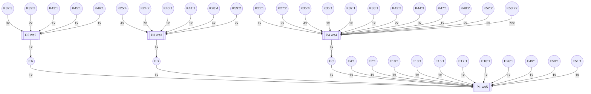

# Material Kosten

```mermaid
graph TD
%% Gekaufte Rohstoffe (K Teile)
    K21((K21:1))
    K24((K24:7))
    K25((K25:4))
    K27((K27:2))
    K28((K28:4))
    K32((K32:3))
    K35((K35:4))
    K36((K36:1))
    K37((K37:1))
    K38((K38:1))
    K39((K39:2))
    K40((K40:1))
    K41((K41:1))
    K42((K42:2))
    K43((K43:1))
    K44((K44:3))
    K45((K45:1))
    K46((K46:1))
    K47((K47:1))
    K48((K48:2))
    K52((K52:2))
    K53((K53:72))
    K59((K59:2))

%% Vorliegende Eigenfabrikate (E Teile)
    E4((E4:1))
    E7((E7:1))
    E10((E10:1))
    E13((E13:1))
    E16((E16:1))
    E17((E17:1))
    E18((E18:1))
    E26((E26:1))
    E49((E49:1))
    E50((E50:1))
    E51((E51:1))

%% Zwischenprodukte aus K-Teilen
    EA((EA))
    EB((EB))
    EC((EC))

%% Prozessschritte (alle nach dem Muster: Input --> P --> Output(E))
    P2[[P2 ws2]]
    P3[[P3 ws3]]
    P4[[P4 ws4]]

%% Finaler Prozess: Erzeugt das Endprodukt P1
    P1[[P1 ws5]]

%% Gruppe 1: Verarbeitung von K32, K39, K43, K45, K46 zu Zwischenprodukt EA
    K32 -- "3x" --> P2
    K39 -- "2x" --> P2
    K43 -- "1x" --> P2
    K45 -- "1x" --> P2
    K46 -- "1x" --> P2
    P2 -- "1x" --> EA

%% Gruppe 2: Verarbeitung von K25, K24, K40, K41, K28, K59 zu Zwischenprodukt EB
    K25 -- "4x" --> P3
    K24 -- "7x" --> P3
    K40 -- "1x" --> P3
    K41 -- "1x" --> P3
    K28 -- "4x" --> P3
    K59 -- "2x" --> P3
    P3 -- "1x" --> EB

%% Gruppe 3: Verarbeitung der restlichen K Teile zu Zwischenprodukt EC
    K21 -- "1x" --> P4
    K27 -- "2x" --> P4
    K35 -- "4x" --> P4
    K36 -- "1x" --> P4
    K37 -- "1x" --> P4
    K38 -- "1x" --> P4
    K42 -- "2x" --> P4
    K44 -- "3x" --> P4
    K47 -- "1x" --> P4
    K48 -- "2x" --> P4
    K52 -- "2x" --> P4
    K53 -- "72x" --> P4
    P4 -- "1x" --> EC

%% Finaler Prozess P1: Kombination der Zwischenprodukte und der vorliegenden E Teile
    EA -- "1x" --> P1
    EB -- "1x" --> P1
    EC -- "1x" --> P1
    E4 -- "1x" --> P1
    E7 -- "1x" --> P1
    E10 -- "1x" --> P1
    E13 -- "1x" --> P1
    E16 -- "1x" --> P1
    E17 -- "1x" --> P1
    E18 -- "1x" --> P1
    E26 -- "1x" --> P1
    E49 -- "1x" --> P1
    E50 -- "1x" --> P1
    E51 -- "1x" --> P1

```
