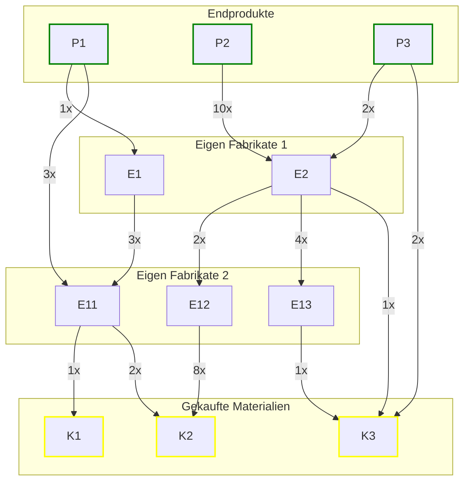

## Materialbedarf

- **Endprodukte:**
    - Jedes Endprodukt ($I_{P1}, I_{P2}, I_{P3}$) besteht aus einer Kombination von
      Zwischenprodukten und
      Eigenfertigungsprodukten.
    - Die Stücklisten enthalten auch die benötigten Kaufteile.

Wir können die Stücklisten in einem Directed Acyclic Graph (DAG) darstellen, um die Abhängigkeiten
der Produkte darzustellen.



#### Einleitung

Eine Stückliste (Bill of Materials, **BOM**) kann als gerichteter azyklischer Graph (DAG) dargestellt
werden. Dabei repräsentieren die Knoten die einzelnen **Produkte**, **Eigenfabrikate**
und **Kaufteile** (zusammenfassend als **Komponenten** bezeichnet).

Jeder Kante ist eine **Menge** $q$ zugeordnet, die angibt, wie viele Einheiten der
untergeordneten Komponente benötigt werden.

#### Mathematische Herleitung

Sei:

- $I_P$ ein Endprodukt
- $I_n$ *(Item)* eine beliebige Komponente (Eigenfabrikat oder Kaufteil).


Die gesamte benötigte Menge von $I_n$ ergibt sich aus der Summe der Mengen,
die auf allen möglichen **Pfaden** von $I_P$ zu $I_n$ benötigt werden.
Jeder einzelne Pfad $p$ von $I_P$ nach $I_n$ trägt
dabei mit folgender Berechnung zur Gesamtmenge bei:

!!! info "Materialbedarf bestimmen"
Das bedeutet: Für jede einzelne **Komponente** summieren wir über alle möglichen Produktionspfade
hinweg das Produkt der aufeinanderfolgenden Mengen entlang der Kanten.

---

#### Produkt Materialanforderungen

Wir verwenden eine rekursive Methode zur Berechnung des gesamten Materialbedarfs einer Komponente,
indem wir den Graphen von oben nach unten durchlaufen. Jeder Knoten multipliziert seinen aktuellen
Bedarfsfaktor mit der benötigten Menge seiner untergeordneten Komponenten.

??? details "Python-Implementierung"
    ```python
        def compute_requirements(component, multiplier):
        """
            Berechnet den gesamten Materialbedarf für eine gegebene Komponente.
    
            :param component: Die aktuelle Komponente (Produkt, Eigenfabrikat oder Kaufteil)
            :param multiplier: Die Menge, die von dieser Komponente benötigt wird
            :return: Ein Dictionary mit der Gesamtmenge jeder benötigten Komponente
            """
            requirements = {}
        
            # Wenn die Komponente keine weiteren Abhängigkeiten hat (also ein Kaufteil ist)
            if component.is_leaf():
                requirements[component] = multiplier
                return requirements
        
            # Iteriere über alle abhängigen Komponenten
            for child, amount in component.children:
                quantity = multiplier * amount
                child_requirements = compute_requirements(child, quantity)
        
                # Aggregiere die Anforderungen
                for item, count in child_requirements.items():
                    requirements[item] = requirements.get(item, 0) + count
        
            return requirements
    ```

---

#### Gesamtbedarfs für Produktionsplan

Ein **Produktionsplan** gibt an, wie viele Einheiten jedes Endprodukts produziert werden sollen. Um
den gesamten Materialbedarf für die geplante Produktion zu berechnen, iterieren wir über alle
Endprodukte und summieren die berechneten Anforderungen.

##### Python-Implementierung

??? details "Python Implementierung"
    ```python
        def compute_total_requirements(production_plan):
        """
            Berechnet den gesamten Materialbedarf für einen Produktionsplan.
    
            :param production_plan: Dictionary mit Endprodukten und geplanten Produktionsmengen
            :return: Dictionary mit der Gesamtmenge jeder benötigten Komponente
        """
            total_requirements = {}
        
            for product, planned_quantity in production_plan.items():
                # Berechne Anforderungen für das einzelne Endprodukt
                # noinspection PyUnresolvedReferences
                requirements = compute_requirements(product, planned_quantity)
        
                # Summiere die Mengen für alle Komponenten auf
                for component, amount in requirements.items():
                    total_requirements[component] = total_requirements.get(component, 0) + amount
        
            return total_requirements
    ```

---

#### Materialbedarf bei vorhandenem Lagerbestand

Neben den berechneten Anforderungen aus dem Produktionsplan gibt es auch einen **Lagerbestand**, der
angibt, wie viele Einheiten jeder Komponente bereits verfügbar sind. Um zu bestimmen, wie viel
zusätzlich produziert oder eingekauft werden muss, vergleichen wir die berechneten *
*Gesamtanforderungen** mit dem vorhandenen Bestand.

##### Vorgehensweise

1. Berechne mit `compute_total_requirements` den gesamten Materialbedarf für den Produktionsplan.
2. Vergleiche den berechneten Bedarf mit dem vorhandenen Lagerbestand.
3. Falls der Lagerbestand eine Komponente bereits abdeckt, wird diese nicht weiter produziert oder
   gekauft.
4. Falls der Lagerbestand nicht ausreicht, wird die Differenz als **tatsächlicher Produktions- oder
   Beschaffungsbedarf** gespeichert.

##### Python-Implementierung

??? details "Python Implementierung"
    ```python
        def compute_production_needs(production_plan, inventory):
        """
        Berechnet den Produktions-, Bestellbedarfs basierend auf dem Produktionsplan und Lager.
    
            :param production_plan: Dictionary mit geplanten Produktionsmengen für Endprodukte
            :param inventory: Dictionary mit der vorhandenen Menge jeder Komponente im Lager
            :return: Dictionary mit der zusätzlichen Menge, die produziert oder eingekauft werden muss
            """
            # noinspection PyUnresolvedReferences
            total_requirements = compute_total_requirements(production_plan)
            production_needs = {}
        
            for component, required_amount in total_requirements.items():
                stock = inventory.get(component, 0)
        
                # Falls Lagerbestand reicht, Bedarf = 0
                production_needs[component] = max(required_amount - stock, 0)
        
            return production_needs
    ```

---

#### Fazit

Mit diesem Ansatz kann für einen gegebenen Produktionsplan der **exakte Materialbedarf** für alle
Komponenten berechnet werden. Zudem kann durch den Abgleich mit dem Lagerbestand bestimmt werden,
**wie viel tatsächlich hergestellt oder beschafft** werden muss.
