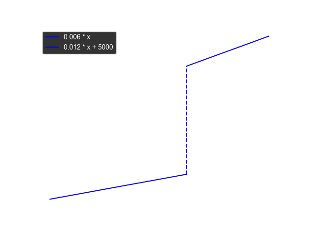

# Lagerkosten

$$
f(x) =
\begin{cases}
0.006 \cdot x, & x < 250\,000 \\
5\,000 + 0.012 \cdot x, & x \geq 250\,000
\end{cases}
$$

## Erwartungswert des Lagerwertes

Der Lagerwert kann nicht genau hervorgesagt werden. Es gibt Unsicherheiten in den Bestellungen.
Wir definieren den Lagerwert $SV$ als normalverteilte Zufallsvariable mit Erwartungswert $\mu_{SV}$ und
Standardabweichung $\sigma_{SV}$.

Aus den genannten Lagerkostenfunktion und der genannten Verteilung des Lagerwertes können wir eine
erwartete
Kostenwertfunktion
$C_S(SV)$ ableiten.
muss der Erwartungswert in zwei Bereiche aufgeteilt werden:

- $k$ = 1000

$$
\begin{aligned}
E[C_S(SV)] = \quad 0.006 \cdot SV \cdot  P(SV < 250k) \enspace+\\
\quad (5k + 0.012 \cdot SV) \cdot P(SV \geq 250k)
\end{aligned}
$$

was sich vereinfacht zu:
wobei:

- $P(SV \geq 250\,000)$ die Wahrscheinlichkeit ist, dass der Speicherkapazitätswert den Schwellenwert
  überschreitet.

## Berechnung der Wahrscheinlichkeit

??? details Berechnung der beschnittenen Erwartungswerte
    Da $SV \sim N(e, \sigma^2)$, berechnet man:
    
    $$
    P(SV \geq 250\,000) = 1 - \Phi\Bigl(\frac{250\,000 - e}{\sigma}\Bigr)
    $$
    
    wobei $\Phi$ die CDF der Standardnormalverteilung ist.
    Mit Hilfe der Eigenschaften der **beschnittenen Normalverteilung** lassen sich die Erwartungswerte
    wie folgt ableiten:
    
    $$
    E[SV \mid SV < 250\,000] = SV - \sigma \, \frac{\phi(z)}{\Phi(z)}
    $$
    
    $$
    E[SV \mid SV \geq 250\,000] = SV + \sigma \, \frac{\phi(z)}{1 - \Phi(z)}
    $$
    
    wobei:
    
    - $z = \frac{250\,000 - e}{\sigma}$
    - $\phi(z)$ die PDF der Standardnormalverteilung ist
    - $\Phi(z)$ die CDF der Standardnormalverteilung darstellt

## Lagerkosten Berechnung

Für einen erwarteten Lagerwert von $E(SV)$ und einer Standardabweichung von $\sigma$ ergibt sich der
Erwartungswert der Lagerkosten:

$$
E[C_S(SV)] =\quad
\begin{aligned}
     0.006\cdot \Bigl(SV - \sigma\frac{\phi(z)}{\Phi(z)}\Bigr) \cdot \Phi(z) \quad + \quad \\
    \Bigl(5k +0.012 \cdot (SV + \sigma\frac{\phi(z)}{1-\Phi(z)})\Bigr) \cdot (1-\Phi(z))
\end{aligned}
$$

wobei

$$
z=\frac{250k-SV}{\sigma}\quad\text{und}\quad \sigma=r\cdot E[SV]
$$

## Graph für ausgewählte Abweichungen

Für ausgewählte Abweichungen:

$$
\sigma=0.05 \cdot E[SV] \quad \sigma=0.1 \cdot E[SV] \quad \sigma=0.25 \cdot E[SV]
$$

!!! note Abweichungen
    Diese Abweichungen wurden einfach für diesen Graphen ausgewählt und
    haben keine spezielle Bedeutung. Die wirklichen Abweichungen ergeben sich aus den Lieferer
    Zeitenabweichungen.
    Die Berechnung der genauen Abweichung für eine Periode ist kompliziert.

## Color Map Standard Deviation, Erwartungswert

Die erwarteten Lagerkosten berechnen sich aus Erwartungswert und Standardabweichung der Erwartung.
Dies können wir nicht in einem normalen 2d Plot darstellen. Daher verwenden wir eine Color Map, um die
erwarteten Lagerkosten für verschiedene Erwartungswerte und Standardabweichungen darzustellen.

$$ESC(E(C_S), \sigma_CS) \equiv \text{Erwartete Lagerkosten } (\textit{expected storage cost})$$

somit ist:

$$ \frac{ESC(E(C_S), \sigma_CS)}{E(C_S)} \equiv \text{relative erwartete Lagerkosten} $$

=== "Absolute Kosten"

    | $E(SV)$ | $\sigma=0.05e$ | $\sigma=0.1e$ | $\sigma=0.25e$ |
    |---------|----------------|---------------|----------------|
    | 200k    | 1 200          | 1 200         | 2 200          |
    | 225k    | 1 400          | 2 000         | 3 500          |
    | 250k    | 5 000          | 5 000         | 5 000          |
    | 275k    | 8 000          | 7 000         | 6 000          |
    | 300k    | 8 600          | 8 000         | 7 500          |

=== "Relative Kosten"

    | $E(SV)$ | $\sigma=0.05e$ | $\sigma=0.1e$ | $\sigma=0.25e$ |
    |---------|----------------|---------------|----------------|
    | 200k    | 0,6%           | 0,6%          | 1,1%           |
    | 225k    | 0,6%           | 0,9%          | 1,6%           |
    | 250k    | 2,0%           | 2,0%          | 2,0%           |
    | 275k    | 2,9%           | 2,6%          | 2,2%           |
    | 300k    | 2,9%           | 2,7%          | 2,5%           |

!!! important Steigung der Absoluten Lagerkosten
        Interessant ist auch die Steigung der Absoluten Lagerkosten.
        Also die Ableitung der Lagerkosten.

