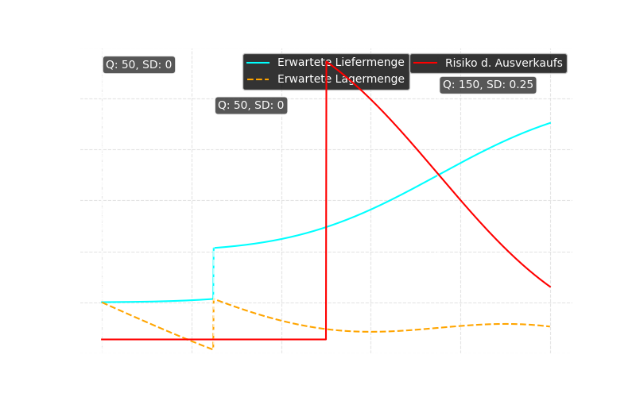

<!-- @formatter:off -->

# Produktionsplanung

## Lager und Prozess

In diesem Modell wird das Lager als Vektor dargestellt, der alle Items (IDs 1 bis 59) enthält. Ein
Prozess $P$ verändert den Lagerbestand, indem er Input-Ressourcen verbraucht und Output-Ressourcen
hinzufügt.

!!! warning "Namenskonflikt $P$ und $P$"
      Obwohl $P$ ursprünglich auch für fertige Produkte verwendet wird, nutzen wir hier $P$ für
      Prozesse. Die Unterscheidung erfolgt durch den Kontext.

### Lagerdefinition

Der Lagerbestand wird als Vektor definiert:

$$
\mathbf{Inv} = \begin{pmatrix} Inv_1 \\ Inv_2 \\ \vdots \\ Inv_{59} \end{pmatrix} \in \mathbb{N}_0^{59}.
$$

Dabei entspricht $Inv_i$ der Anzahl des Items mit der eindeutigen ID $i$.

Die Items werden in drei Vektoren der Größe 59 dargestellt, die jeweils eindeutige IDs besitzen:

- **$E = (E_1, E_2, \dots, E_{59})$**: Selbst erstellte Zwischenprodukte
- **$K = (K_1, K_2, \dots, K_{59})$**: Gekaufte Teile
- **$P = (P_1, P_2, \dots, P_{59})$**: Fertige Produkte

Diese Vektoren bilden zusammen die Gesamtheit der Items:

$$
I = E \cup K \cup P.
$$

Für jedes $n \in \{1,2,\dots,59\}$ gilt mathematisch:

$$
\left|\{ X \in \{E_n, K_n, P_n\} \mid X \neq \varnothing \}\right| = 1.
$$

Das heißt, für jede eindeutige ID $n$ existiert genau ein Itemtyp (entweder $E_n$, $K_n$ oder $P_n$), der definiert ist, während die anderen beiden "leer" (undefiniert) sind.

### Prozessdefinition

$$
P = \left( \, \mathbf{p}_I,\enspace \mathbf{p}_O,\enspace ws,\enspace T_{setup},\enspace T_{proc} \, \right)
$$

wobei

- $\mathbf{p}_I \in \mathbb{N}_0^{59}$ der Inputvektor ist,
- $\mathbf{p}_O \in \mathbb{N}_0^{59}$ der Outputvektor ist,
- $ws \in WS$ die zugehörige Workstation darstellt,
- $T_{setup}\in \mathbb{R}_{\ge 0}$ die Rüstzeit und
- $T_{proc} \in \mathbb{R}_{\ge 0}$ die Durchführungszeit ist.

#### Ausführungsbedingung

Ein Prozess $P$ darf nur ausgeführt werden, wenn der Inputvektor $\mathbf{p}_I$ subtrahiert vom
aktualisierten Lagerbestand, in jeder Komponente
nicht negativ ist. Mathematisch formulieren wir dies als:

$$
\mathbf{Inv} + \mathbf{p}_I \ge \mathbf{0},
$$

wobei $\mathbf{0}$ der Nullvektor in $\mathbb{R}^{59}$ ist. Das heißt, für alle
Items $i \in \{1,2,\dots,59\}$ gilt:

$$
Inv_i + p_{I,i} \ge 0.
$$

#### Lageraktualisierung

Wird der Prozess $P$ ausgeführt, so ändert sich der Lagerbestand gemäß:

$$
\mathbf{Inv}' = \mathbf{Inv} - \mathbf{p}_I + \mathbf{p}_O
$$

Hierbei ist $\mathbf{Inv}'$ der neue Lagerbestand nach Durchführung des Prozesses.

## Einfachster Fall – Ohne Lagerbestand

Angenommen, ein Produkt benötigt ein einzelnes Kaufteil, das vor Produktionsbeginn geliefert werden
muss. Gleichzeitig wird an der Workstation eine feste Rüstzeit ausgeführt, die – sofern möglich –
parallel zur Materiallieferung erfolgen kann. Wir wollen 320 Einheiten des Produkts herstellen.

### Mathematisch
<!-- @formatter:on -->

| Bezeichnung                                 | Symbol          | Wert         |
|---------------------------------------------|-----------------|--------------|
| Lagerbestand                                | $\mathbf{Inv}$  | $\mathbf{0}$ |
| Durchschnittliche Lieferzeit für $K_1$      | $\mu L(K_1)$    | $0.5$        |
| Standardabweichung der Lieferzeit für $K_1$ | $\sigma L(K_1)$ | $0.25$       |
| Anzahl der Durchführungen                   | $n$             | $320$        |
| Kosten für Bestellung von $K_1$             | $C_L(K_1)$      | $100$        |

<!-- @formatter:off -->

Wir haben ein leeres Inventar und einen Prozess, der ein Kaufteil $K_1$ benötigt. Dieses wird mit
einer
durchschnittlichen Lieferzeit von 0.5 Perioden und einer Standardabweichung von 0.25 Perioden
geliefert.
Die Rüstzeit beträgt 60 Minuten, die Durchführungszeit 6 Minuten. Es wird 1 $E_2$ je Durchführung
produziert.

### Diagram Einfacher Prozess

```mermaid
graph LR
    K1((K1))
    P1[[Prozess P1]]
    E2((E2))
    K1 -- " 1x " --> P1
    P1 -- " 1x " --> E2
    classDef bought fill: #443333, stroke: white, stroke-width: 1px;
    class K1 bought;
    classDef product fill: #333344, stroke: white, stroke-width: 1px;
    class E2 product;
    classDef workstation fill: #222266, stroke: white, stroke-width: 1px;
    class P1 workstation;
```

### Prozess Definition

$$
P_0 = \left( \begin{pmatrix} 1 \\ 0 \\ 0 \\ \cdots \end{pmatrix}, \begin{pmatrix} 0 \\ 1 \\ 0 \\ \cdots \end{pmatrix}, WS_1, 60, 2 \right)
$$

## Arbeitsstation Variablen

- Lohnkostensatz Schicht 1:      $\quad\quad L_1(ws) = 0.5$
- Lohnkostensatz Schicht 2:    $\quad\quad L_2(ws) = 0.6$
- Lohnkostensatz Schicht 3:    $\quad\quad L_3(ws) = 0.75$
- Lohnkostensatz Überstunden:  $\quad L_O(ws) = 0.9$

!!! note "Kostensatz Einheit"
        Die Lohnkostensätze sind in Geldeinheiten pro Minute $GE/min$ angegeben.

## Zeitliche Parameter der Prozesse

<!-- @formatter:on -->

| Symbol      | Bedeutung                                                                             | Wert    | 
|-------------|---------------------------------------------------------------------------------------|---------|
| $T_{setup}$ | Rüstzeit: Einmalige Zeit zum Einrichten(unabhängig von der Anzahl der Durchführungen) | 120 min |
| $T_{proc}$  | Durchführungszeit: Zeitdauer für eine einzelne Durchführung des Prozesses             | 6 min   |
| $n$         | Anzahl der Durchführungen eines Prozesses                                             | 320     |
| $T_{total}$ | Gesamtdauer zur Durchführung eines Prozesses                                          | -       |

<!-- @formatter:off -->
Ein einzelner Prozess $P_k$ benötigt die entsprechende Rüstzeit, falls die Workstation, davor
von einem anderen Prozess belegt war. Die Durchführungszeit ist unabhängig davon.

### Berechnung der Gesamtdauer
#### Einmaliger Prozess
Wenn $ws(P_k)$ davor von anderem Prozess besetzt:

$$
T_{total} = T_{setup} + T_{proc}
$$

$$
\text{Ansonsten: } \quad T_{total} = T_{proc}
$$

#### Mehrfachige Ausführung
Falls wir den Prozess mehrfach ausführen also $n > 1$, dann müssen wir maximal einmal die Rüstzeit
berechnen.

Wenn $ws(P_k)$ davor von anderem Prozess besetzt:

$$
T_{total} = T_{setup} + T_{proc} \cdot n
$$

$$
\text{Ansonsten: } \quad T_{total} = T_{proc} \cdot n
$$

#### Beispiel Dauerberechnung

$$
T_{total} = 120~min + 320 \cdot 6~min = 2040~min = 34~h
$$

### Bestellszenarien
#### Normale Bestellung & 1 Schicht

Zeiten in Perioden.
<!-- @formatter:on -->

| Zeitpunkt[p] | Wochentag | Ereignis                         |   |
|--------------|-----------|----------------------------------|---|
| 0            | Mo        | Normale Bestellung von 320 $K_1$ |   |
| 0.5          | ~Mi       | Lieferung von $K_1$              |   |
| 0.6          | Do        | $K_1$ verfügbar                  |   |

<!-- @formatter:off -->

Eine Periode mit einer Schicht hat 2400 Arbeits Minuten.
$$
T(ws_1) = 2400
$$

$$
\text{Nutzbare Zeit:} \quad util_T(P)= T(ws) \cdot (1 - T_A(K)) - T_{setup}(P)
$$

$$
util_T(P_1) = 2400min \cdot (1 - 0.6) - 120min = 840min
$$

$$
Menge ~E1 = 1140~min / 6~min = 140
$$

##### Fazit
Die Produktion wird nicht fertiggestellt, da die Menge von 140 Einheiten unter der erforderlichen
Menge von 320 Einheiten liegt.

#### Normale & 2 Schicht & Überstunden
0 Bestellen von 320 Einheiten von $K_1$ (normale Bestellung)
0.5 Lieferung von $K_1$
120 min Rüstzeit
Eine Periode mit 2 shifts hat 2400 * 2 Minuten.

$$
util_T(P_1) = 2400min \cdot 2 \cdot (1 - 0.6) - 120min = 1800 min
$$

$$
Menge ~E1 = 1800 / 6min = 300
$$

$$
300 \geq 320 \rightarrow \text{Auftrag wird nicht fertiggestellt}
$$

$$
\text{Überstunden:} \quad T_O = 20 \cdot 6min = 120min
$$

$$
\text{Kosten} CL_{ws_1} = 2400 \cdot ( 0.5 + 0.6) + 120 \cdot 0.9
$$

!!! note "Vernachlässigung Maschinenkosten"
       Die Maschinenkosten werden hier nicht berücksichtigt, da sie für die Optimierung kein einen Unterschied machen.
       Die Variablen Maschinenkosten lassen sich kaum optimieren, nur durch Rüstzeiten minimierung die wir hier nicht machen
       Fixen Kosten haben gewisse Veränderung durch 2 Schichten aber gering.

##### Fazit
Die Produktion wird fertiggestellt. Mit 2 Schichten und Überstunden.

#### Eilbestellung

| Zeitpunkt[p] | Wochentag | Ereignis                     |   |
|--------------|-----------|------------------------------|---|
| 0            | Mo        | Eil Bestellung von 320 $K_1$ |   |
| 0.25         | ~Di       | Lieferung von $K_1$          |   |
| 0.4          | Mi        | $K_1$ verfügbar              |   |

$$
util_T(P_1) = 2400min \cdot (1 - 0.4) - 120min = 1320min
$$

$$
util_T(P_1) \geq 320 \cdot 6 \rightarrow \text{Auftrag wird fertiggestellt}
$$

$$
util_T(P_1) \geq 1920
$$

$$
T_O = 1920 - 1320 = 600min
$$

##### Fazit
Die Produktion wird fertiggestellt. Mit 1 Schicht und Überstunden.
Dafür Kosten für Eilbestellung

## Einfluss eines vorhandenen Lagers

Liegt ein Lagerbestand von K1 vor, kann die Produktion bereits mit den vorhandenen Materialien
starten. Fehlt ein Teil des Materials, muss – abhängig vom Zeitpunkt der Lieferung – gewartet
werden.

1. **Ausreichender Lagerbestand ($Inv_{K1} \ge X$):**  
   Steht das gesamte Material vorrätig zur Verfügung, entfällt die Wartezeit:

2. **Teilweise Deckung ($0 < Inv_{K1} < X$):**  
   Die Produktion kann zunächst mit den vorhandenen $Inv_{K1}$ Einheiten starten. Fehlt Material,
   entsteht eine Wartezeit, sofern die Zeit bis zur Lieferung die Zeit für Rüstung und Produktion
   der vorhandenen Einheiten übersteigt:

Wir haben ein Lagerbestand von $x$ Einheiten von $K_1$. Also bestellen wir $320 - x$ Einheiten.

<!-- @formatter:on -->

| Zeitpunkt[p]               | Wochentag | Ereignis                               |   |
|----------------------------|-----------|----------------------------------------|---|
| 0                          | Mo        | Normale Bestellung von $320 - x$ $K_1$ |   |
| 0                          | Mo        | Ausführen von $320 - x$ $K_1$          |   |
| $T_{setup} + x * T_{proc}$ | ?         | Beendigen                              |   |
| 0.5                        | ~Mi       | Lieferung von $K_1$                    |   |
| 0.6                        | Do        | $K_1$ verfügbar                        |   |

---

### Benötigte Lagermenge

#### Produzierbare Menge ab Bestellungsankunft

$$
util_T(P_1) = 2400~min \cdot (1 - 0.6) - 120~min = 840~min
$$

$$
Menge ~E1 = 1140~min / 6~min = 140
$$

#### Fehlende Menge

$$
\text{Fehlende Menge: } \quad x = 320 - 140 = 180
$$

Bei normaler Bestellung und einer Schicht. Also müssten wir $180~K_1$ im Lager haben.

### Fazit

Durch Lagerung von Zwischenprodukten können wir die Personalkosten stark senken und Leerkosten
verhindern.
Die Kosten für die Lagerung müssen natürlich geringer sein um das ganze auszugleichen.

## Kompliziertere Fälle

### komplexer Prozess

```mermaid
graph LR
    K1((K1))
    K2((K2))
    K3((K3))
    P1[[Prozess P1 ws1]]
    PX[[Prozess PX ws2]]
    E5((E5))
    E4((E4))
    K1 -- " 1x " --> PX
    PX -- " 1x " --> E4
    E4 -- " 1x " --> P1
    K2 -- " 1x " --> P1
    K3 -- " 1x " --> P1
    P1 -- " 1x " --> E5
    classDef bought fill: #443333, stroke: white, stroke-width: 1px;
    class K1 bought;
    class K2 bought;
    class K3 bought;
    classDef product fill: #333344, stroke: white, stroke-width: 1px;
    class E5 product;
    class E4 product;
    classDef workstation fill: #222266, stroke: white, stroke-width: 1px;
    class P1 workstation;
    classDef someWorkstation fill: #222222, stroke: gray, stroke-width: 1px;
    class PX someWorkstation;
```

### Erklärung

- Der Prozess P1 benötigt 1x K2, 1x K3 und 1x E4
- Der Prozess PX benötigt 1x K1. Nach der Ausführung von PX wird E4 produziert.

Daher müssen wir darauf achten, dass wir die Ressourcen für P1 rechtzeitig zur Verfügung haben.

!!! warning "Komplizierte Rechnungen"
      Die Berechnungen für solche Prozesse sind komplizierter und erfordern eine detaillierte
      Analyse. Hier wird nur ein einfaches Beispiel gezeigt.

### Vereinfachung
- Mehr Lagerbestand verringert die Wartezeit
- Mehr Lagerbestand erhöht die Lagerkosten
- Mehr Lagerbestand verringert die Personalkosten
- Eilbestellungen senken die Wartezeit und den durchschnittlichen Lagerbestand

### Grafische Darstellung

