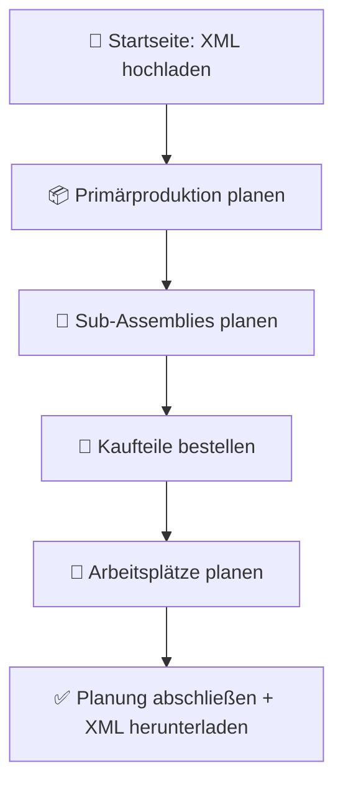

# Frontend – Dokumentation der Benutzerführung (IBSYS2)

## 🔄 Ablaufbeschreibung

### 1. **Startseite – XML Upload**

- Der Nutzer lädt die XML-Datei hoch (vom SCS-System exportiert).
- Das System analysiert die Datei.
- Bei Erfolg beginnt der Planungsprozess automatisch.

### 2. **Primärproduktion planen**

- Es werden Prognosen für die Nachfrage von P1, P2 und P3 angezeigt.
- Der Nutzer gibt an, wie viel von jedem Produkt in der nächsten Periode produziert werden soll.

### 3. **Sub-Assembly Planung**

- Eine Tabelle zeigt die aktuelle Menge und den berechneten Bedarf der Zwischenprodukte.
- Der Nutzer kann die empfohlenen Werte bearbeiten.

### 4. **Bestellplanung (Kaufteile)**

- Anzeige: Bestand, Bedarf, empfohlene Bestellmengen.
- Vorschläge durch das System (Normal- / Eilbestellung).
- Der Nutzer kann eigene Bestellungen hinzufügen oder ändern.

### 5. **Arbeitsplatzplanung (Workstations)**

- Tabelle mit allen 15 Arbeitsplätzen.
- Gezeigt werden: Prozesszeit, Anzahl Rüstvorgänge, Rüstzeit.
- Nutzer kann Anzahl Schichten und Überstunden manuell anpassen.

### 6. **Planung abschließen**

- Der Nutzer sieht eine Zusammenfassung aller Entscheidungen.
- Download-Link für die neue XML-Datei zur Eingabe ins SCS-System.

---

## 📊 Visualisierung – User Flow (Mermaid)

---

| Seite                | Inhalt                                                                |
|----------------------|-----------------------------------------------------------------------|
| **Startseite**       | Datei-Upload, Prüfung der XML, Start-Button                           |
| **Primärproduktion** | Prognose-Anzeige, Eingabefelder für P1–P3, Validierung, Weiter-Button |
| **Sub-Assemblies**   | Tabelle mit aktuellem Bestand + Bedarf, Eingabefelder, Weiter-Button  |
| **Bestellplanung**   | Tabelle mit Kaufteilen, Bestellvorschlägen, Eingabefelder             |
| **Workstations**     | Tabelle mit 15 WS, Prozesszeiten, Rüstungen, Schichtauswahl           |
| **Abschlussseite**   | Zusammenfassung, Validierung, XML-Download-Link                       |

