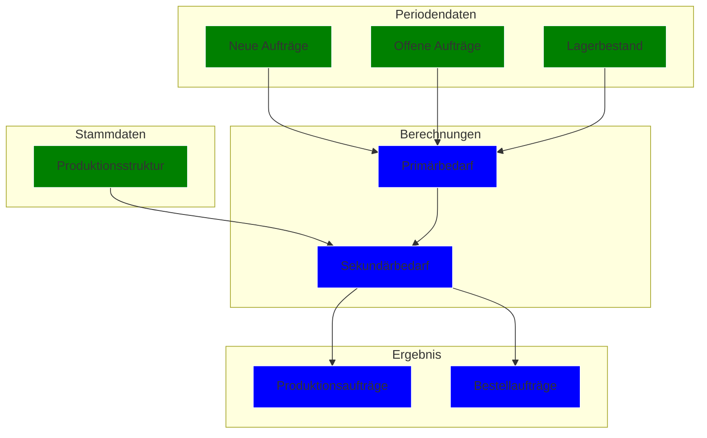
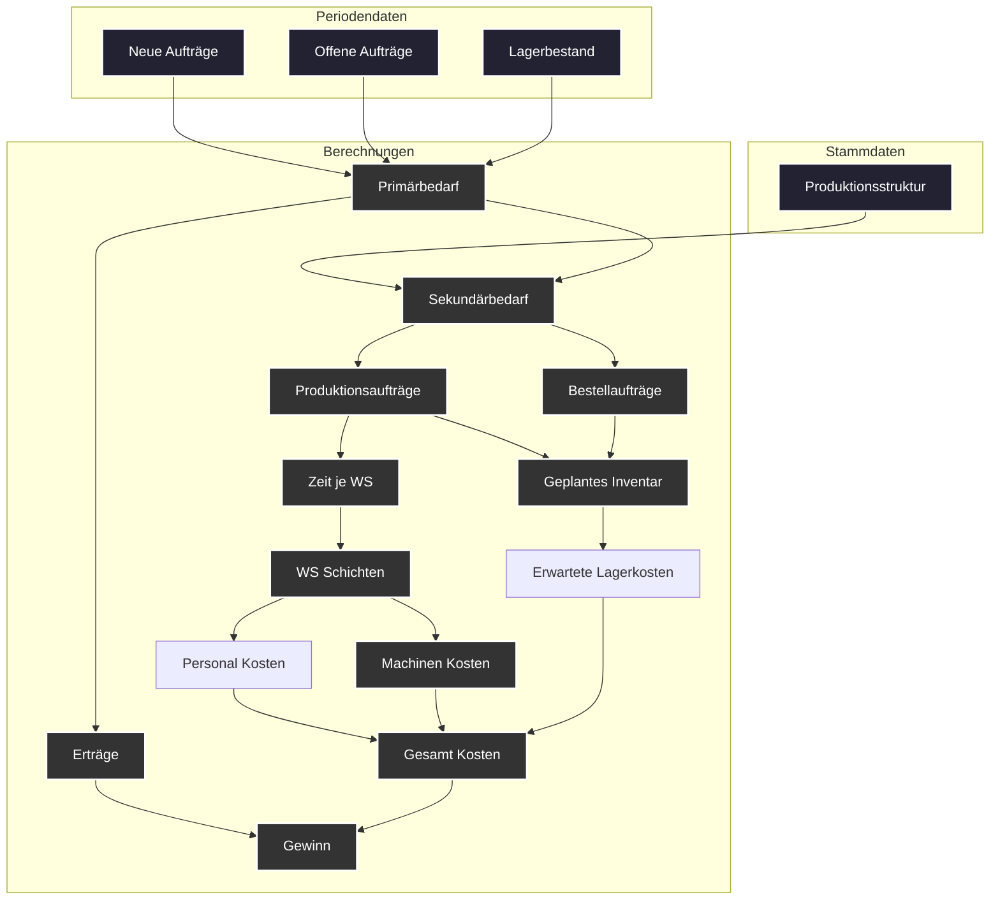

# Planung & Optimierung

## Schritt-für-Schritt-Planungsablauf

### Primärbedarf ermitteln

- Einlesen der Verkaufsaufträge und Prognosen.
- Berechnung des Bedarfs an Endprodukten (P1, P2, P3) unter Abzug des vorhandenen Lagerbestands.

### Bestandsprüfung

- Abgleich des vorhandenen Lagerbestands (Vorperiode) mit dem Bedarf.
- Festlegung des Soll-Lagerbestands (Sicherheitsbestand).

### Berechnung des Sekundärbedarfs

- Auswertung der Stücklisten der Endprodukte.
- Ermittlung des Bedarfs an Eigenfertigungsprodukten und Zwischenprodukten.
- Berücksichtigung der Werte der einzelnen Komponenten zur späteren Kostenkalkulation.

### Berechnung des Tertiärbedarfs

- Ableitung der benötigten Kaufteile aus den Stücklisten der internen Fertigungsprodukte.
- Abgleich mit vorhandenen Beständen und Ermittlung von Bestellmengen unter Berücksichtigung von
  Lieferzeiten.

### Kapazitätsprüfung:

- Ermittlung des Gesamt-Kapazitätsbedarfs (Produktionszeit + Rüstzeiten + Rückstände).
- Vergleich mit den verfügbaren Kapazitäten der Arbeitsplätze.
- Falls Engpässe vorliegen: Priorisierung und ggf. Verteilung der Aufträge über mehrere Perioden.

### Erstellung der Produktions- und Bestellaufträge:

- Festlegung der **Produktionsaufträge** für Endprodukte sowie für Zwischen- und
  Eigenfertigungsprodukte.
- Ableiten von **Bestellaufträgen** für Kaufteile.
- Zusammenführung aller Aufträge und Festschreibung der geplanten Produktion.

### Kalkulation und Dokumentation:

- Berechnung der Herstellkosten unter Einbeziehung:
    - Materialwerte (aus Stücklisten, inkl. Zwischenprodukte)
    - Fertigungs- und Rüstzeiten (Arbeits- und Maschinenkosten)
    - Lagerhaltungskosten (auf Basis des Lagerwerts)
- Speicherung der **geplanten Produktionsaufträge**, der **Bestellaufträge** sowie der **erwarteten
  Lagerbestände**
  als Eingangsgrößen für die nächste Periode.

---

## Datenfluss im Planungsprogramm

1. **Eingabe:**
    - **Stammdaten:** Produktionsstruktur, Stücklisten (mit Mengen und Werten), Kapazitätsdaten,
      Anfangslagerbestände.
    - **Periodenspezifische Daten:** Verkaufsaufträge, Prognosen, Rückstände, Bestände, offene
      Fertigungsaufträge.

2. **Berechnungsmodul:**
    - Ermittlung von Primär-, Sekundär- und Tertiärbedarf.
    - Kapazitätsplanung (inkl. Rüstzeiten und Überstunden).
    - Kostenkalkulation (Materialwerte, Produktionszeiten, Lagerhaltung).

3. **Ausgabe:**
    - Produktionsplan: Welche Endprodukte, Zwischenprodukte und Eigenfertigungsprodukte in welcher
      Menge hergestellt
      werden.
    - Bestellplan: Welche Kaufteile in welcher Menge bestellt werden müssen.
    - Aktualisierte Lagerbestände und Kapazitätsauslastungen.
    - Kalkulierte Herstellkosten und Vergleich Soll/Ist (über Formularvorlagen).

### Diagramm

!!! note Vereinfachung
    Keine Beachtung der Optimierung über mehrere Perioden. Keine Einbeziehung der Prognosen.

## Wichtiges zur Optimierung

### Primärbedarf

Der Primärbedarf berechnet sich sehr einfach aus den Verkaufsaufträgen und den offenen Aufträgen.

#### Höhere Produktion als Bedarf
Wie optimiert man den Primärbedarf? Sollte man immer genau so viel produzieren wie beauftragt wird.
Es könnte durchaus Sinn machen mehr zu produzieren vor allem, wenn das Inventar niedrig ist und es
wenig Bestellungen gibt.
Da man so schon für die nächste Periode produziert hat. Dies führt zu komplizierten Berechnungen.

#### Niedrigere Produktion als Bedarf
Man sollte weniger produzieren als bestellt wurde, wenn bei weiterer Produktion die Kosten anfangen
höher zu sien als
der Verkaufswert.

### Sekundärbedarf

Der Sekundärbedarf wird ganz einfach berechnet. Dort gibt es nicht zu optimieren. Die Frage ist ob
es Sinn machen kann
mehr von etwas zu produzieren, was man aber garnicht direkt benötigt.
Je nach Rüstzeiten und Kosten kann es durchaus Sinn machen mehr von einem Zwischenprodukt zu
produzieren. Vorallem, wenn dies
von mehreren Endprodukten benötigt wird. Oder Rüstzeiten an Maschine hoch sind. Diese Periode eine
geringe Auslastung
ist und im Lager noch Platz ist.

### Tertiärbedarf - Kaufteile

Die Kaufteile sind ziemlich kompliziert zu optimieren. Je nachdem kann es durchaus Sinn ergeben mehr
zu kaufen als
direkt benötigt wird. Vor allem, wenn Lager Platz hat und Lieferzeiten große Abweichungen haben.
Außerdem ist es wichtig
10 % Rabatt zu bekommen durch die bestellte Menge. So, dass man prinzipiell einen Kostenvorteil hat wenn
man mehr Bestellt.

### Benötigte Workstations

Aus Sekundärbedarf berechnet sich die benötigten Arbeiten je Arbeitsstation Workstation

### Arbeitsschichten

Wie viele Schichten müssen für welche Workstations angeordnet werden?
Kann das klar berechnet werden? Also für festgelegte Produktionen gibt es eine direkt zu
berechnende einfache optimale?
Könnte es Sinn machen etwas zu produzieren aber dann nicht die Kapazität zu haben?
Eher nicht.

### Maschinenkosten & Arbeitskosten

Aus den Arbeitsschichten und der Produktion berechnen sich die Arbeitskosten und die
Maschinenkosten. Diese sind sehr wichtig. Müssen auf jedenfall optimiert werden.
Also, wenn Kosten zu hoch muss weniger produziert werden.
Nötige Kapazitäten sollten natürlich optimal genutzt werden. Weitere Schichten kosten deutlich mehr
als vorherige.

### Geplantes Inventar

Aus den KKaufteilen sowie dem geplanten Verbrauch ergibt sich natürlich ein Plan dafür wie viel das
Lager kosten wird

### Gesamt Kosten

Aus den Maschinenkosten, Arbeitskosten und Lagerkosten ergibt sich die Gesamtkosten. Diese sollten
natürlich minimiert werden.

### Erträge

Aus den Verkaufsaufträgen und den geplanten Produktionen ergibt sich der Ertrag.

### Gewinn

Der Gewinn ergibt sich aus den Erträgen abzüglich der Gesamtkosten.

### Flowchart Planung Optimiert

!!! question Optimierung
    Ist das ganze nicht ein lineares Optimierungsproblem?
    mit Variablen und Bedingungen?
    Sowie einer Zielfunktion!
    
    Optimierungsproblem mit Variablen und Bedingungen, sollte man mit Google OR Tools lösen können.
