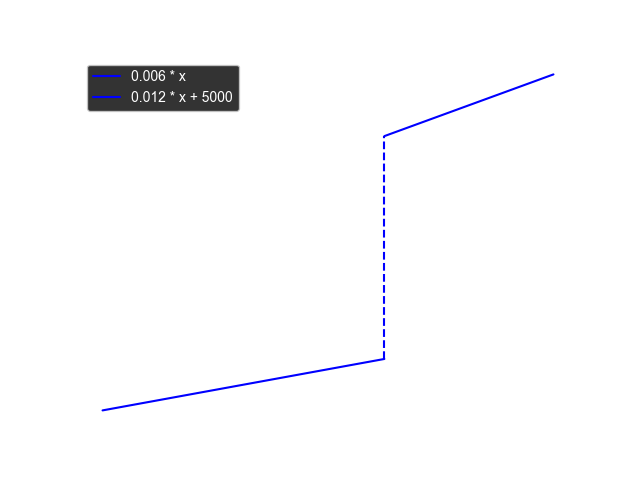
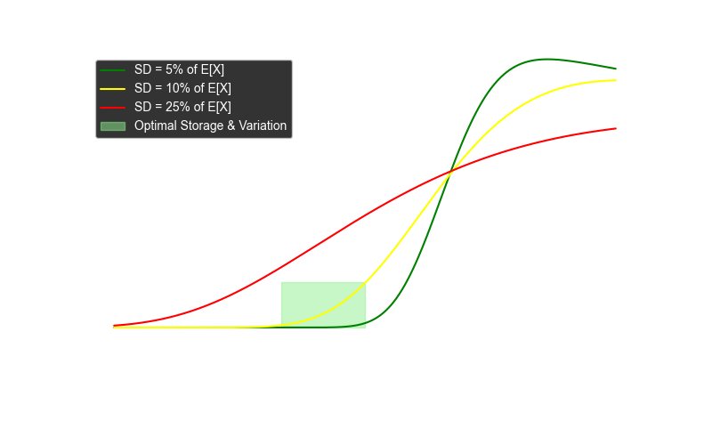

# Planung & Optimierung

## Schritt-für-Schritt-Planungsablauf

### Primärbedarf ermitteln:

- Einlesen der Verkaufsaufträge und Prognosen.
- Berechnung des Bedarfs an Endprodukten (P1, P2, P3) unter Abzug des vorhandenen Lagerbestands.

### Bestandsprüfung:

- Abgleich des vorhandenen Lagerbestands (Vorperiode) mit dem Bedarf.
- Festlegung des Soll-Lagerbestands (Sicherheitsbestand).

### Berechnung des Sekundärbedarfs

- Auswertung der Stücklisten der Endprodukte.
- Ermittlung des Bedarfs an Eigenfertigungsprodukten und Zwischenprodukten.
- Berücksichtigung der Werte der einzelnen Komponenten zur späteren Kostenkalkulation.

### Berechnung des Tertiärbedarfs

- Ableitung der benötigten Kaufteile aus den Stücklisten der internen Fertigungsprodukte.
- Abgleich mit vorhandenen Beständen und Ermittlung von Bestellmengen unter Berücksichtigung von
  Lieferzeiten.

### Kapazitätsprüfung:

- Ermittlung des Gesamt-Kapazitätsbedarfs (Produktionszeit + Rüstzeiten + Rückstände).
- Vergleich mit den verfügbaren Kapazitäten der Arbeitsplätze.
- Falls Engpässe vorliegen: Priorisierung und ggf. Verteilung der Aufträge über mehrere Perioden.

### Erstellung der Produktions- und Bestellaufträge:

- Festlegung der **Produktionsaufträge** für Endprodukte sowie für Zwischen- und
  Eigenfertigungsprodukte.
- Ableiten von **Bestellaufträgen** für Kaufteile.
- Zusammenführung aller Aufträge und Festschreibung der geplanten Produktion.

### Kalkulation und Dokumentation:

- Berechnung der Herstellkosten unter Einbeziehung:
    - Materialwerte (aus Stücklisten, inkl. Zwischenprodukte)
    - Fertigungs- und Rüstzeiten (Arbeits- und Maschinenkosten)
    - Lagerhaltungskosten (auf Basis des Lagerwerts)
- Speicherung der **geplanten Produktionsaufträge**, der **Bestellaufträge** sowie der **erwarteten
  Lagerbestände**
  als Eingangsgrößen für die nächste Periode.

---

## Datenfluss im Planungsprogramm

1. **Eingabe:**
    - **Stammdaten:** Produktionsstruktur, Stücklisten (mit Mengen und Werten), Kapazitätsdaten,
      Anfangslagerbestände.
    - **Periodenspezifische Daten:** Verkaufsaufträge, Prognosen, Rückstände, Bestände, offene
      Fertigungsaufträge.

2. **Berechnungsmodul:**
    - Ermittlung von Primär-, Sekundär- und Tertiärbedarf.
    - Kapazitätsplanung (inkl. Rüstzeiten und Überstunden).
    - Kostenkalkulation (Materialwerte, Produktionszeiten, Lagerhaltung).

3. **Ausgabe:**
    - Produktionsplan: Welche Endprodukte, Zwischenprodukte und Eigenfertigungsprodukte in welcher
      Menge hergestellt
      werden.
    - Bestellplan: Welche Kaufteile in welcher Menge bestellt werden müssen.
    - Aktualisierte Lagerbestände und Kapazitätsauslastungen.
    - Kalkulierte Herstellkosten und Vergleich Soll/Ist (über Formularvorlagen).

### Vereinfachtes Modell wenn man nur eine Periode planen würde

Und man das Lager nicht optimiert;

```mermaid
flowchart TD
%% Stammdaten (konstant)
    subgraph "Stammdaten"
        PRODSTR["Produktionsstruktur"]
    end

%% Periodendaten (variabel)
    subgraph "Periodendaten"
        OPEN_SALES["Offene Aufträge"]
        SALES["Neue Aufträge"]
        CURINV["Lagerbestand"]
    end

%% Berechnungen
    subgraph "Berechnungen"
        PRIM["Primärbedarf"]
        SEK["Sekundärbedarf"]
    end

%% Ergebnis
    subgraph "Ergebnis"
        PRODORD["Produktionsaufträge"]
        BESTORD["Bestellaufträge"]
    end

%% Datenfluss
    SALES --> PRIM
    OPEN_SALES --> PRIM
    CURINV --> PRIM
    PRODSTR --> SEK
    PRIM --> SEK
    SEK --> BESTORD
    SEK --> PRODORD
class PRODSTR,TEILDAT,CAPCOST,SALES,OPEN_SALES,CURINV inputData;
class PRIM,NET,SEK,TER,PRODORD,BESTORD,NEWINV calcData;
class RES resultData;
classDef inputData fill: green;
classDef calcData fill: blue;
classDef resultData fill: yellow;

````

## Wichtiges zur Optimierung

### Lagerkosten:

- Lagerkosten sind sprungfix, also muss ich aufpassen nicht über disen Betrag(250 000) zu kommen.
- Ich kann die Lagerkosten nicht genau planen, da es Lieferabweichungen gibt und die Bestellungen zu
  zufälligen Zeiten
  eintreffen ?
- Werden die Lagerkosten über die durchschnittlische Lagermenge berechnet? Oder zahle ich die
  spungfixen Kosten wenn
  Lager kurze Zeit zu voll ist?
- Risiko dafür berechnen, dass Lager zu voll. Risiko Lagerwert > 250 k. Risiko sollte unter 10%
  sein;
- Durch Eilbestellungen niedrigeres Risiko, aber höhere Bestellkosten.
- Kaufteile mit größten Abweichungen führen zu höheren Risiken.
- Von Kaufteilen mit langer Lieferzeit mehr im Lager haben. Von Kaufteilen mit hoher Abweichung mehr
  auf Lager haben.
- Teile welche für mehrere Endprodukte benötigt werden, mehr auf Lager haben.

#### Lagerkosten Funktion

$$
f(x) =
\begin{cases}
0.006 \cdot x, & x < 250\,000 \\
5\,000 + 0.012 \cdot x, & x \geq 250\,000
\end{cases}
$$



#### Erwartungswert des Lagerwertes

Der Lagerwert kann nicht genau hervorgesagt werden. Es gibt Unsicherheiten in den Bestellungen.
Wir definieren den Lagerwert $X$ als normalverteilte Zufallsvariable mit Erwartungswert $e$ und
Standardabweichung $sd$.

Aus den genannten Lagerkostenfunktion und der genannten Verteilung des Lagerwertes können wir eine
erwartete
Kostenwertfunktion
$f(X)$ ableiten.
muss der Erwartungswert in zwei Bereiche aufgeteilt werden:

$$
E[f(X)] = E[0.006X \mid X < 250 \cdot e^{3}] \, P(X < 250 \cdot e^{3}) + E[5000 + 0.012X \mid X \geq 250 \cdot e^{3}] \, P(X \geq 250 \cdot e^{3})
$$

was sich vereinfacht zu:

$$
E[f(X)] = 0.006 \cdot E[X \mid X < 250 \cdot e^{3}] \, P(X < 250 \cdot e^{3}]) + \Bigl(5000 + 0.012 \cdot E[X \mid X \geq 250\cdot e^{3}]\Bigr) \, P(X \geq 250\cdot e^{3})
$$

wobei:

- $P(X \geq 250\,000)$ die Wahrscheinlichkeit ist, dass der Speicherkapazitätswert den Schwellenwert
  überschreitet.
- $E[X \mid X \geq 250\,000]$ und $E[X \mid X < 250\,000]$ die bedingten Erwartungswerte von $X$
  oberhalb bzw. unterhalb
  des Schwellenwerts sind.

#### Berechnung der Wahrscheinlichkeit $P(X \geq 250\,000)$

Da $X \sim N(e, sd^2)$, berechnet man:

$$
P(X \geq 250\,000) = 1 - \Phi\Bigl(\frac{250\,000 - e}{sd}\Bigr)
$$

wobei $\Phi$ die kumulative Verteilungsfunktion (CDF) der Standardnormalverteilung ist.

#### Berechnung der beschnittenen Erwartungswerte

Mit Hilfe der Eigenschaften der **beschnittenen Normalverteilung** lassen sich die Erwartungswerte
wie folgt ableiten:

$$
E[X \mid X < 250\,000] = e - sd \, \frac{\phi(z)}{\Phi(z)}
$$

$$
E[X \mid X \geq 250\,000] = e + sd \, \frac{\phi(z)}{1 - \Phi(z)}
$$

wobei:

- $z = \frac{250\,000 - e}{sd}$
- $\phi(z)$ die Dichtefunktion (PDF) der Standardnormalverteilung ist
- $\Phi(z)$ die kumulative Verteilungsfunktion (CDF) der Standardnormalverteilung darstellt

#### Berechnung der erwarteten Speicherpreis

Setzt man nun alles zusammen:

$$
E[f(X)] = 0.006 \Bigl(e - sd \, \frac{\phi(z)}{\Phi(z)}\Bigr) \, \Phi(z) + \Bigl(5000 + 0.012 \Bigl(e + sd \, \frac{\phi(z)}{1 - \Phi(z)}\Bigr)\Bigr) \, (1 - \Phi(z))
$$

#### Lagerkosten Berechnung

Für einen erwarteten Lagerwert von $e$ und einer Standardabweichung von $sd$ ergibt sich der
Erwartungswert der
Lagerkosten

$$
E[f(X)] = 0.006\Bigl(e - sd\frac{\phi(z)}{\Phi(z)}\Bigr)\Phi(z) + \Bigl(5000+0.012\Bigl(e+ sd\frac{\phi(z)}{1-\Phi(z)}\Bigr)\Bigr)(1-\Phi(z))
$$

wobei
$$
z=\frac{250000-e}{sd}\quad\text{und}\quad sd=r\cdot e.
$$

##### Graph für ausgewählte Abweichungen



Für ausgewählte Abweichungen $sd=0.05e$, $sd=0.1e$ und $sd=0.25e$; Diese wurden einfach für diesen
Graphen ausgewählt
und
haben keine spezielle Bedeutung. Die wirklichen Abweichungen ergeben sich aus den Lieferer
Zeitenabweichungen.
Die Berechnung der genauen Abweichung für eine Periode ist kompliziert.

Unter der Betrachtung, dass eine Abweichung von unter 10% realistisch ist, wäre es wahrscheinlich am
Besten,
mit einem Lagerwert von 230 000 zu planen.
Ein zu kleiner Lagerwert würde dazu führen, dass wir zu iel für die fix Kosten der Maschinen zahlen.
Daher muss der Lagerwert optimiert werden.

##### Color Map Standard Deviation, Erwartungswert

Die erwarteten Lagerkosten berechnen sich aus Erwartungswert und Standardabweichung der Erwartung.
Dies
können wir nicht in einem normalen 2d Plot darstellen. Daher verwenden wir eine Color Map, um die
erwarteten
Lagerkosten für verschiedene Erwartungswerte und Standardabweichungen darzustellen.

$$ e = \text{erwartete Lagerkosten}$$
$$ sd = Standardabweichung $$
$$ESC(e, sd) = \text{Erwartete Lagerkosten } (\textit{expected storage cost})$$
somit ist:
$$ \frac{ESC(e, sd)}{e} = \text{relative erwartete Lagerkosten} $$
Wahrscheinlich ist es am besten mit einem $e$ und $sd$ zu planen, bei
dem $\frac{ESC(e, sd)}{e} < 0.01$
Dies ist ungefähr in der Abbildung gezeigtem Dreieck der Fall:

Dreieck:
$$ e = 200 \cdot e^3\, sd=001$$
$$ e = 200 \cdot e^3\, sd=0.20$$
$$ e = 240 \cdot e^3\, sd =0.01$$

| Erwartungswert $e$ | $sd=0.05e$ | $sd=0.1e$ | $sd=0.25e$ |
|--------------------|------------|-----------|------------|
| 200k               | 1 200      | 1 200     | 2 200      |
| 225k               | 1 400      | 2 000     | 3 500      |
| 250k               | 5 000      | 5 000     | 5 000      |
| 275k               | 8 000      | 7 000     | 6 000      |
| 300k               | 8 600      | 8 000     | 7 500      |

**Relative Kosten**:

| Erwartungswert $e$ | $sd=0.05e$ | $sd=0.1e$ | $sd=0.25e$ |
|--------------------|------------|-----------|------------|
| 200k               | 0,6%       | 0,6%      | 1,1%       |
| 225k               | 0,6%       | 0,9%      | 1,6%       |
| 250k               | 2,0%       | 2,0%      | 2,0%       |
| 275k               | 2,9%       | 2,6%      | 2,2%       |
| 300k               | 2,9%       | 2,7%      | 2,5%       |

### Primärbedarf

Der Primärbedarf berechnet sich sehr einfach aus den Verkaufsaufträgen und den offenen Aufträgen.
Wie optimiert man den Primärbedarf? Sollte man immer genau so viel produzieren wie beauftragt wird.
Es könnte durchaus Sinn machen mehr zu produzieren vorallem wenn das Inventar niedrig ist und es
wenig Bestellungen
gibt.
Da man so schon für die nächste Periode produziert hat. Dies führt zu komplizierten Berechnungen.
Man sollte weniger produzieren als bestellt wurde, wenn bei weiterer Produktion die Kosten anfangen
höher zu sien als
der Verkaufswert.

Dadurch dass es nur drei Produkte gibt, somit hier nur 3 Variblen, kann man ziemlich einfach
optimieren.
Wenn man die andeen Werte auds dem Primärbedarf berechnen kann. Dann kann ich ja einfach:
Bei Basislösung
$$x_0; y_0; z_0$$
Nächste Lösung berechnen in dem ich das Maximum aller Möglichkeiten nehme eins der Werte +1 oder -1
zu rechnen.
Das sind zum Glück nur 6 Möglichkeiten. Dann dies höchstens 3_000 wiederholen, da Werte im Spiel
keinesfalls über 1000
liegen.
$$ x+1 \, y\, z$$

### Sekundärbedarf

Der Sekundärbedarf wird ganz einfach berechnet. Dort gibt es nicht zu optimieren. Die Frage ist ob
es Sinn machen kann
mehr von etwas zu produzieren was man aber garniucht direkt benötigt.
Je nach Rüstzeiten und Kosten kann es durchaus Sinn machen mehr von einem Zwischenprodukt zu
produzieren. Vorallem wenn
dies
von mehreren Endprodukten benötigt wird. Oder Rüstzeiten an Maschine hoch sind. Diese Periode eine
geringe Auslastung
ist und im Lager noch Platz ist.

### Tertiärbedarf - Kaufteile

Die Kaufteile sind ziemlich kompliziert zu optimieren. Je nachdem kann es durchaus Sinn ergeben mehr
zu Kaufen als
direkt benötigt wird. Vorallem wenn Lager Platz hat und Lieferzeiten große Abweichungen haben.
Außerdem ist es wichtig
10% Rabatt zu bekommen durch die Bestellte Menge. Sodass man prinzipiell einen Kostevorteil hat wenn
man mehr Bestellt.

### Benötigte Workstations

Aus Sekundärbedarf berechnet sich die Benötigten Arbeiten je Arbeitsstation Workstation

### Arbeitsschichten

Wie viele Schichten müssen für welche Workstations angeordnet werden?
Kann das klar berechnet werden? Also für festgelegte Produktionen, gibt es eine direkt zu
berechnende einfache optimale ?
Könnte es Sinn machen etwas zu produzieren aber dann nicht die Kapazität zu haben ?
Eher nicht.

### Maschinenkosten & Arbeitskosten

Aus den Arbeitsschichten und der Produktion berechnen sich die Arbeitskostren und die
Maschinenkosten. Diese sind sehr wichtig. Müssen auf jedenfall optimiert werden.
Also wenn Kosten zu hoch muss weniger produziert werden.
Nötige Kapazitäten sollten natürlich optimal genutzt werden. Weitere Schichten kosten deutlich mehr
als vorherige.

### Geplantes Inventar

Aus den KKaufteilen sowie dem geplanten Verbrauch ergibt sich natürlich ein Plan dafür wie viel das
Lager kosten wird

### Gesamt Kosten

Aus den Maschinenkosten, Arbeitskosten und Lagerkosten ergibt sich die Gesamtkosten. Diese sollten
natürlich minimiert werden.

### Erträge

Aus den Verkaufsaufträgen und den geplanten Produktionen ergibt sich der Ertrag.

### Gewinn

Der Gewinn ergibt sich aus den Erträgen abzüglich der Gesamtkosten.

### Flowchart Planung Optimiert

```mermaid
flowchart TD

%% Stammdaten (konstant)
    subgraph "Stammdaten"
        PRODSTR["Produktionsstruktur"]
    end

%% Periodendaten (variabel)
    subgraph "Periodendaten"
        OPEN_SALES["Offene Aufträge"]
        SALES["Neue Aufträge"]
        CURINV["Lagerbestand"]
    end

%% Berechnungen
    subgraph "Berechnungen"
        PRIM["Primärbedarf"]
        SEK["Sekundärbedarf"]
        WORKSTATION_REQ["Zeit je WS"]
        WORK_TIMES["WS Schichten"]
        WORK_COST["Personal Kosten"]
        MACHINE_COST["Machinen Kosten"]
        PLANNED_INV["Geplantes Inventar"]
        EXPECTED_INV_COST["Erwartete Lagerkosten"]
        TOTAL_COST["Gesamt Kosten"]
        REVENUE["Erträge"]
        EARNINGS["Gewinn"]
        PRODORD["Produktionsaufträge"]
        BESTORD["Bestellaufträge"]
    end

%% Datenfluss
    SALES --> PRIM
    OPEN_SALES --> PRIM
    CURINV --> PRIM
    PRODSTR --> SEK
    PRIM --> SEK
    PRODORD --> WORKSTATION_REQ
    PRODORD --> PLANNED_INV
    WORKSTATION_REQ --> WORK_TIMES
    WORK_TIMES --> WORK_COST
    WORK_TIMES --> MACHINE_COST
    PRIM --> REVENUE
    WORK_COST --> TOTAL_COST
    MACHINE_COST --> TOTAL_COST
    SEK --> BESTORD
    SEK --> PRODORD
    BESTORD --> PLANNED_INV
    PLANNED_INV --> EXPECTED_INV_COST
    EXPECTED_INV_COST --> TOTAL_COST
    REVENUE --> EARNINGS
    TOTAL_COST --> EARNINGS
class PRODSTR, TEILDAT, CAPCOST, SALES, OPEN_SALES, CURINV inputData;
class PRIM, NET, SEK, TER, PRODORD, BESTORD, NEWINV calcData;
class RES resultData;
classDef inputData fill: #223, stroke: #000, stroke-width: 2px, color: #fff;
classDef calcData fill: #333, stroke: #000, stroke-width: 2px, color: #fff;
classDef resultData fill: #232, stroke: #000, stroke-width: 2px, color: #fff;
````

Ist das ganze nicht ein lineares Optimierungsproblem?
mit Variablen und Bedingungen?
Sowie einer Zielfunktion!

Optimierungsproblem mit Variablen und Bedingungen, sollte man mit Google OR Tools lösen können.
