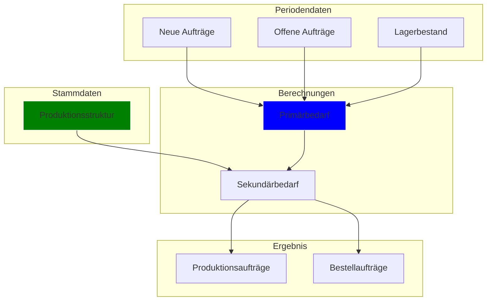
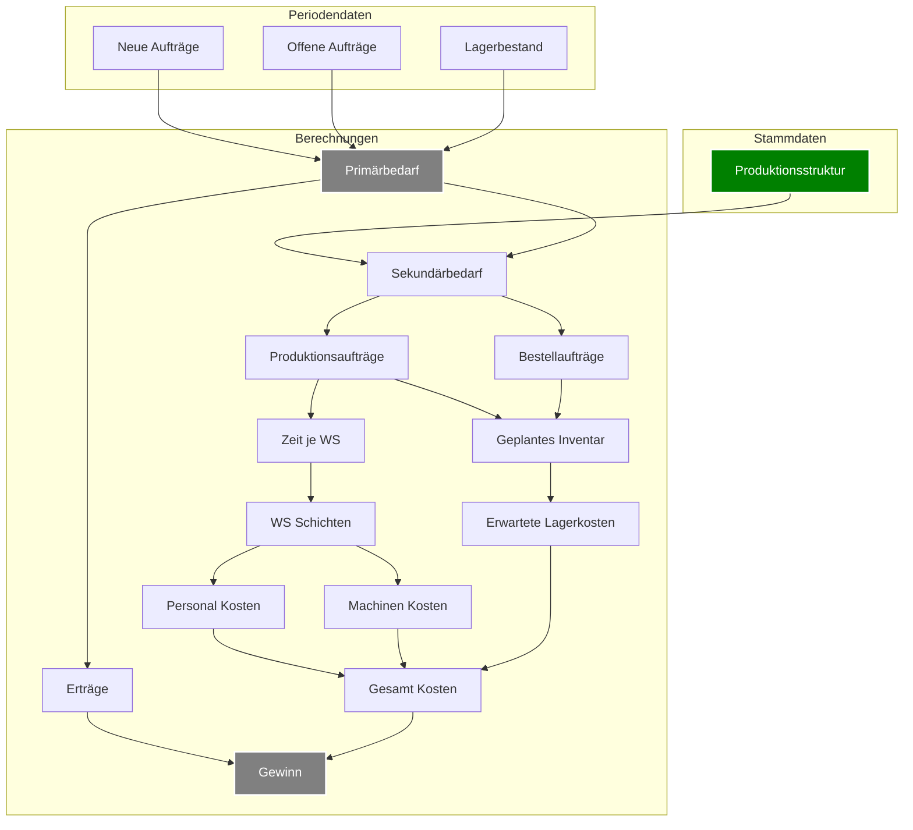

# Planung & Optimierung

## Schritt-für-Schritt-Planungsablauf

### Primärbedarf ermitteln

- Einlesen der Verkaufsaufträge und Prognosen.
- Berechnung des Bedarfs an Endprodukten (P1, P2, P3) unter Abzug des vorhandenen Lagerbestands.

### Bestandsprüfung

- Abgleich des vorhandenen Lagerbestands (Vorperiode) mit dem Bedarf.
- Festlegung des Soll-Lagerbestands (Sicherheitsbestand).

### Berechnung des Sekundärbedarfs

- Auswertung der Stücklisten der Endprodukte.
- Ermittlung des Bedarfs an Eigenfertigungsprodukten und Zwischenprodukten.
- Berücksichtigung der Werte der einzelnen Komponenten zur späteren Kostenkalkulation.

### Berechnung des Tertiärbedarfs

- Ableitung der benötigten Kaufteile aus den Stücklisten der internen Fertigungsprodukte.
- Abgleich mit vorhandenen Beständen und Ermittlung von Bestellmengen unter Berücksichtigung von
  Lieferzeiten.

### Kapazitätsprüfung:

- Ermittlung des Gesamt-Kapazitätsbedarfs (Produktionszeit + Rüstzeiten + Rückstände).
- Vergleich mit den verfügbaren Kapazitäten der Arbeitsplätze.
- Falls Engpässe vorliegen: Priorisierung und ggf. Verteilung der Aufträge über mehrere Perioden.

### Erstellung der Produktions- und Bestellaufträge:

- Festlegung der **Produktionsaufträge** für Endprodukte sowie für Zwischen- und
  Eigenfertigungsprodukte.
- Ableiten von **Bestellaufträgen** für Kaufteile.
- Zusammenführung aller Aufträge und Festschreibung der geplanten Produktion.

### Kalkulation und Dokumentation:

- Berechnung der Herstellkosten unter Einbeziehung:
    - Materialwerte (aus Stücklisten, inkl. Zwischenprodukte)
    - Fertigungs- und Rüstzeiten (Arbeits- und Maschinenkosten)
    - Lagerhaltungskosten (auf Basis des Lagerwerts)
- Speicherung der **geplanten Produktionsaufträge**, der **Bestellaufträge** sowie der **erwarteten
  Lagerbestände**
  als Eingangsgrößen für die nächste Periode.

---

## Datenfluss im Planungsprogramm

1. **Eingabe:**
    - **Stammdaten:** Produktionsstruktur, Stücklisten (mit Mengen und Werten), Kapazitätsdaten,
      Anfangslagerbestände.
    - **Periodenspezifische Daten:** Verkaufsaufträge, Prognosen, Rückstände, Bestände, offene
      Fertigungsaufträge.

2. **Berechnungsmodul:**
    - Ermittlung von Primär-, Sekundär- und Tertiärbedarf.
    - Kapazitätsplanung (inkl. Rüstzeiten und Überstunden).
    - Kostenkalkulation (Materialwerte, Produktionszeiten, Lagerhaltung).

3. **Ausgabe:**
    - Produktionsplan: Welche Endprodukte, Zwischenprodukte und Eigenfertigungsprodukte in welcher
      Menge hergestellt
      werden.
    - Bestellplan: Welche Kaufteile in welcher Menge bestellt werden müssen.
    - Aktualisierte Lagerbestände und Kapazitätsauslastungen.
    - Kalkulierte Herstellkosten und Vergleich Soll/Ist (über Formularvorlagen).

### Diagramm

!!! note Vereinfachung
Keine Beachtung der Optimierung über mehrere Perioden. Keine Einbeziehung der Prognosen.



## Wichtiges zur Optimierung

### Primärbedarf

Der Primärbedarf berechnet sich sehr einfach aus den Verkaufsaufträgen und den offenen Aufträgen.

#### Höhere Produktion als Bedarf

Wie optimiert man den Primärbedarf? Sollte man immer genau so viel produzieren wie beauftragt wird.
Es könnte durchaus Sinn machen mehr zu produzieren vor allem, wenn das Inventar niedrig ist und es
wenig Bestellungen gibt.
Da man so schon für die nächste Periode produziert hat. Dies führt zu komplizierten Berechnungen.

#### Niedrigere Produktion als Bedarf

Man sollte weniger produzieren als bestellt wurde, wenn bei weiterer Produktion die Kosten anfangen
höher zu sien als
der Verkaufswert.

### Sekundärbedarf

Der Sekundärbedarf wird ganz einfach berechnet. Dort gibt es nicht zu optimieren. Die Frage ist ob
es Sinn machen kann
mehr von etwas zu produzieren, was man aber garnicht direkt benötigt.
Je nach Rüstzeiten und Kosten kann es durchaus Sinn machen mehr von einem Zwischenprodukt zu
produzieren. Vorallem, wenn dies
von mehreren Endprodukten benötigt wird. Oder Rüstzeiten an Maschine hoch sind. Diese Periode eine
geringe Auslastung
ist und im Lager noch Platz ist.

### Tertiärbedarf - Kaufteile

Die Kaufteile sind ziemlich kompliziert zu optimieren. Je nachdem kann es durchaus Sinn ergeben mehr
zu kaufen als
direkt benötigt wird. Vor allem, wenn Lager Platz hat und Lieferzeiten große Abweichungen haben.
Außerdem ist es wichtig
10 % Rabatt zu bekommen durch die bestellte Menge. So, dass man prinzipiell einen Kostenvorteil hat wenn
man mehr Bestellt.

### Benötigte Workstations

Aus Sekundärbedarf berechnet sich die benötigten Arbeiten je Arbeitsstation Workstation

### Arbeitsschichten

Wie viele Schichten müssen für welche Workstations angeordnet werden?
Kann das klar berechnet werden? Also für festgelegte Produktionen gibt es eine direkt zu
berechnende einfache optimale?
Könnte es Sinn machen etwas zu produzieren aber dann nicht die Kapazität zu haben?
Eher nicht.

### Maschinenkosten & Arbeitskosten

Aus den Arbeitsschichten und der Produktion berechnen sich die Arbeitskosten und die
Maschinenkosten. Diese sind sehr wichtig. Müssen auf jedenfall optimiert werden.
Also, wenn Kosten zu hoch muss weniger produziert werden.
Nötige Kapazitäten sollten natürlich optimal genutzt werden. Weitere Schichten kosten deutlich mehr
als vorherige.

### Geplantes Inventar

Aus den KKaufteilen sowie dem geplanten Verbrauch ergibt sich natürlich ein Plan dafür wie viel das
Lager kosten wird

### Gesamt Kosten

Aus den Maschinenkosten, Arbeitskosten und Lagerkosten ergibt sich die Gesamtkosten. Diese sollten
natürlich minimiert werden.

### Erträge

Aus den Verkaufsaufträgen und den geplanten Produktionen ergibt sich der Ertrag.

### Gewinn

Der Gewinn ergibt sich aus den Erträgen abzüglich der Gesamtkosten.

### Flowchart Planung Optimiert



````mermaid
flowchart TD
    SALES_FORECAST([Sales Forecast])
    INV([Inventory])
    OPT_PRIM_PROD["Primary Prod\nMath Optimization"]
    CALC_RES_DEMANDS["Use BOM to calculate\n the Res Demand for next periods"]
    OPT_NEXT_PERIOD_PROD["Opt the next period\n best safe stock"]
    CALC_SECONDARY_PROD["Calc secondary prod"]
    OPT_PERIOD_ORDERS["Optimize Orders next Periods"]
    CALC_WS_CAP["Calc Workstation Cap."]
    SALES_FORECAST --> OPT_PRIM_PROD
    INV --> OPT_PRIM_PROD
    OPT_PRIM_PROD --> CALC_RES_DEMANDS
    CALC_RES_DEMANDS --> OPT_NEXT_PERIOD_PROD
    OPT_NEXT_PERIOD_PROD --> CALC_SECONDARY_PROD
    CALC_SECONDARY_PROD --> OPT_PERIOD_ORDERS
    CALC_SECONDARY_PROD --> CALC_WS_CAP
    OPT_PERIOD_ORDERS --> RESULT
    CALC_WS_CAP --> RESULT
````

!!! question Optimierung
Ist das ganze nicht ein lineares Optimierungsproblem?
mit Variablen und Bedingungen?
Sowie einer Zielfunktion!

    Optimierungsproblem mit Variablen und Bedingungen, sollte man mit Google OR Tools lösen können.

Wie viele Entscheidungsvariablen hat man?
Primärbedarf von Endprodukten 3 Integer Variablen, Bereich Begrenzt 50 - 200
Sekundärbedarf von Eigenfertigungsprodukten ca. 20 Integer Variablen 0 <= x < 2*Primärbedarf*BOM
Kaufteile ca. 20 Integer Variablen 0 <= x < 2*Primärbedarf*BOM
7 Perioden

Primärbedarf simple Optimierung
Für die 4 Vorschau Perioden

Minimierung der Produktionsmengen Schwangungen
Minimierung der Lagerkosten

Variable
I = Inventar
I_p = Inventar in Periode p
I_pi = Inventar in Periode p von Produkt i

Eingabe
O = Orders
O_p = Orders in Periode p
O_pi = Orders in Periode p von Produkt i

I_0 = Anfangs Inventar

Ausgabe
P = Produktion
P_p = Produktion in Periode p
P_pi = Produktion in Periode p von Produkt i

Berechnung I
$$
I_p(i) = I_{p-1}(i) + P_p(i) - O_p(i)
$$

Durschnitts Perioden Produktion =
$$
\frac{\sum{P_p(i)}}{4}
$$

Squared Produktions Abweichung von Durchschnitt =
$$
\sum{(P_p(i) - \mu)^2}
$$

Lagerkosten Faktor von Periode p = Sum(I_p) ^ 2

Bedingungen

Inventar für alle p und i >= 0
$$
I_p(i) >= 0
$$

Produktion für alle p und i >= 0
$$
P_p(i) >= 0
$$

Ein komplettes Mathematisches Optimierungsproblem bauen.
Bei welchem wir unser Inventar von jedem Produkt haben dann haben wir eben die Produktion.
Und machen es so dass man die Zwischenprodukte genau so viel Produzieren muss wie das Bauteil.

Als Restriktion darf das Inventar natürlich nicht kleiner als 0 sein

Inventar berechnet sich aus vorherigem Inventar und natürlich aus dem Verbrauch, welcher durch die Zwischenprodukte
berechnet wird.
Aus der Produktion berechnet sich auch der Bedarf der Arbeitsstationen Setup Costs werden geschätzt.

Wir überschätzen die Rüstzeiten und gehen von vielen Leerzeiten aus.
Wenn das vorgeschlagene Produktionsprogramm nicht möglich ist, dann geben wir ein negatives oder unendlich schlechtes
Ergebnis zurück

Eingabe 25 Eigen Produzierte Produkte Anzahl in 10er Schritten;

Eingabe für 25 Kaufprodukte Anzahl Eil und Anzahl Normal.

Und dass dann für die nächsten 4 Perioden.

Also ca. 400 Variablen

Dann Berechnung Inventar aus Produktion und vorherigem Inventar;

Setup Zeit einer Arbeitsstation ist,


---

### **1. Gegeben:**

- **$m$** verschiedene Prozesse, die an der Workstation durchgeführt werden.
- **$N$** Gesamtzahl an durchzuführenden Prozessen (Anzahl der produzierten Einheiten / 10).
- **\( t_{\text{rüst},i} \)** Rüstzeit für Prozess \( i \) (unterschiedlich für verschiedene Prozesse).
- **\( f_i = \frac{n_i}{N} \)** Häufigkeit jedes Prozesses \( i \), also sein Anteil an den gesamten 10er-Losen.
- **Nicht rein zufällige Reihenfolge, aber auch keine vollständige Blockbildung.**

---

### **2. Abschätzung der Wechselanzahl**

Da die Reihenfolge **nicht zufällig** ist, aber auch nicht perfekt gruppiert, nehmen wir eine **gemäßigte
Wechselwahrscheinlichkeit** an.  
Eine brauchbare Heuristik dafür ist:

\[
W = (N - 1) \times \Bigl( 1 - \sum_{i=1}^{m} f_i^p \Bigr)
\]

mit einem **Anpassungsfaktor \( p \) zwischen 1 und 2**, der zwischen Block- und Zufallsproduktion interpoliert:

- \( p = 1 \) entspricht der rein zufälligen Reihenfolge.
- \( p = 2 \) entspricht der stark gruppierten Produktion.

Für moderate Fertigungsumstellungen könnte ein Wert von **\( p = 1.5 \)** passend sein.

---

### **3. Abschätzung der Gesamt-Rüstzeit**

Nun multiplizieren wir die Wechselanzahl mit einer gewichteten durchschnittlichen Rüstzeit:

\[
T_{\text{rüst, gesamt}} \approx W \times \sum_{i=1}^{m} f_i \cdot t_{\text{rüst},i}
\]

- **\( f_i \cdot t_{\text{rüst},i} \)** gewichtet die Rüstzeit nach Häufigkeit.
- **\( W \)** ist die geschätzte Anzahl der Wechsel.

Falls alle Rüstzeiten ähnlich sind, kann man auch einfach:

\[
T_{\text{rüst, gesamt}} \approx W \times \overline{t}_{\text{rüst}}
\]

verwenden, wobei \(\overline{t}_{\text{rüst}}\) das Mittel der Rüstzeiten ist.


-----


----


Mögliche Aufzuteilende Aufgaben

### Datenanalyse

Datenanalyse an den Materiaalien, deren Kosten. Die Bestellzeiten sowie deren Kosten
Die Arbeitsstationen, die Prozesse deren Reihenfolge, längsten Pfade.

Kosten pro Produkt

Analyse von bestehenden Daten aus den Perioden

### Reorder Pointss Berechnen

Berechnung zu Kosten der Bestellungen und mögliche Bestellung

### REST API erstellen

Die Programmierung der REST API
Tests der REST API
